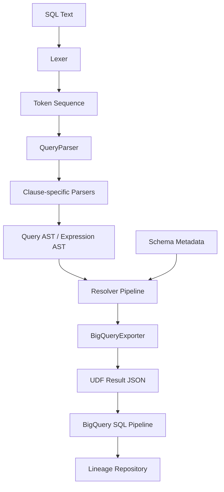
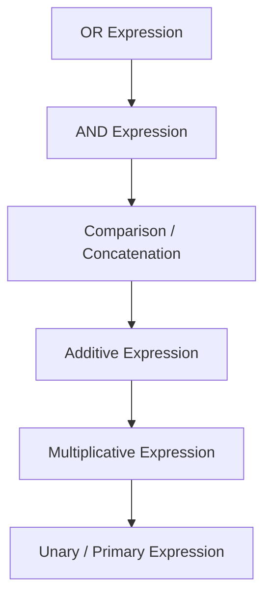
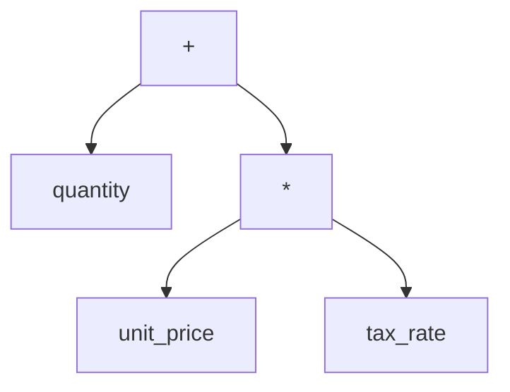
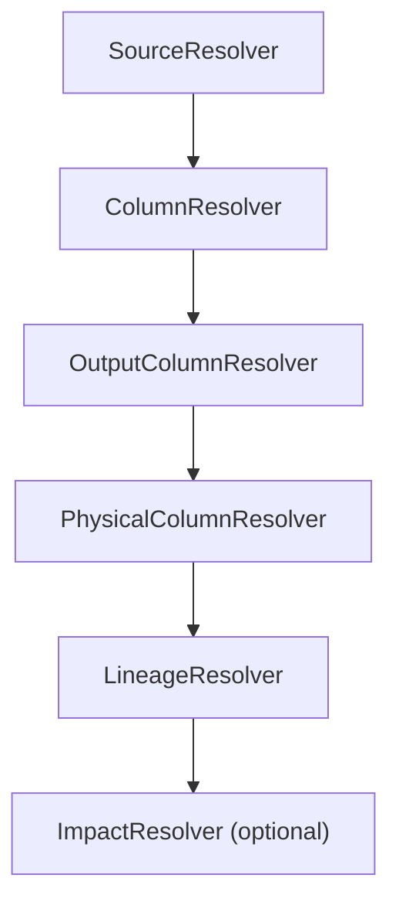
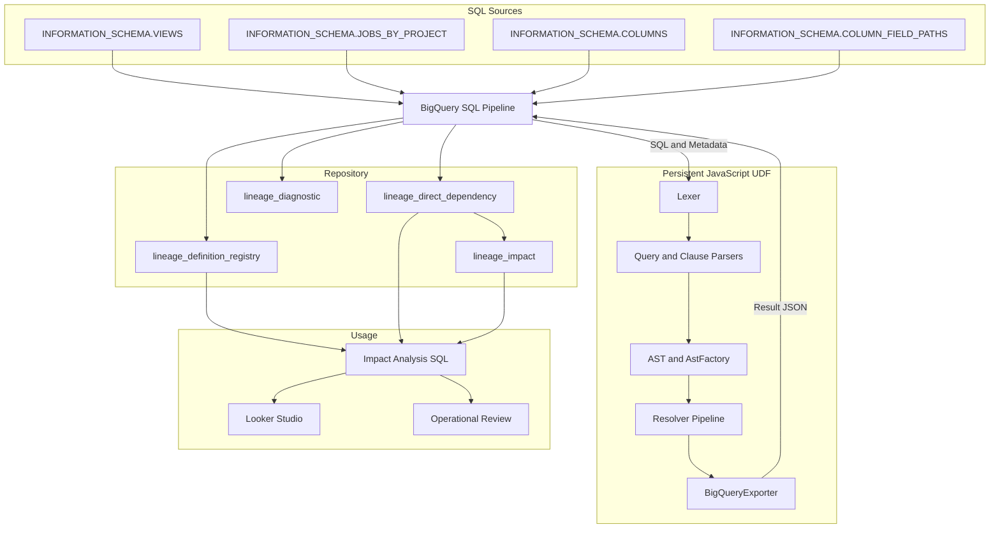

# BigQuery Physical Lineage Architecture Overview

> **Version:** 0.9 Draft  
> **Implementation baseline:** lineage v1.5.0-028

---

## 目次

1. システム概要
2. カラムレベル解析が必要となる理由
3. SQL解析アーキテクチャ
4. JavaScript UDFによる解析基盤
5. 実装方式の検討
6. 全体構成
7. 設計上の前提・対象範囲（Scope）
8. 今後の拡張性
9. 用語

---

# 1. システム概要

## 1.1 背景

BigQueryを利用したデータ基盤では、テーブル、View、Scheduled Query、DAGなどを通じて、多数のデータオブジェクトが相互に参照される。

物理テーブルのカラム変更や廃止を行う場合、運用担当者は次の点を確認する必要がある。

- 変更対象のカラムを参照しているViewはどれか
- そのViewのどの出力カラムへ影響するか
- 下流のViewや生成テーブルへ、どこまで影響が伝播するか
- CTEやサブクエリを経由した間接依存が存在しないか
- 削除済みViewや生成されなくなったテーブルがRepositoryへ残っていないか

テーブル単位の依存関係だけでは、これらを十分な精度で判断できない。

本システムは、**カラムレベルのPhysical Lineage Repository**を構築し、影響分析の精度と効率を改善する。

## 1.2 目的

> **BigQuery上の物理テーブルまたはカラム変更時に、影響を受ける下流オブジェクトとカラムを、正確かつ効率的に特定できる状態を作る。**

この目的のために、以下を行う。

- View定義および実行済みSQLを収集する
- SQLを構文解析する
- 出力カラムと入力カラムの対応関係を解決する
- 中間ViewやCTEを経由した依存関係を物理カラムまで展開する
- Repositoryへ依存情報を登録する
- 影響範囲をRankまたは深さとして提示する

## 1.3 解決する運用課題

### 影響調査の精度不足

テーブル単位の依存情報では、対象カラムがどの出力カラムへ影響するかを判断できない。結果として、実際には影響しないオブジェクトまで調査候補へ含まれる。

### 影響調査の作業負荷

SQLを目視で追跡する方法では、SQL数と複雑性が増えるほど調査時間が増大する。CTE、サブクエリ、`SELECT *`、式、別名、ネスト構造がある場合は特に負荷が高い。

### Repositoryの鮮度維持

依存関係は一度構築すれば終わりではない。Viewの追加・変更・削除、Scheduled Queryの変更、DAG実行SQLの変更、生成されなくなったテーブルを継続的に反映する必要がある。

## 1.4 設計原則

1. **実行結果に近い情報を利用する**  
   Viewは定義SQL、Scheduled QueryやDAGはJOBSへ記録された実行SQLを利用する。

2. **BigQuery中心で運用する**  
   常駐サーバや別アプリケーションを必須とせず、BigQuery SQLとJavaScript UDFを中心に構成する。

3. **再実行可能性を持つ**  
   日次処理の再実行によって重複や不整合が発生しにくい構成とする。

# 2. カラムレベル解析が必要となる理由

## 2.1 テーブルレベル依存関係だけでは不足する理由

```sql
CREATE VIEW mart.order_summary AS
SELECT
  order_id,
  quantity * unit_price AS total_amount,
  customer_id
FROM raw.orders;
```

テーブルレベルでは、`mart.order_summary` が `raw.orders` を参照することまでしか分からない。

運用で必要となる情報は次である。

| 出力カラム | 入力カラム |
|---|---|
| `order_id` | `raw.orders.order_id` |
| `total_amount` | `raw.orders.quantity` |
| `total_amount` | `raw.orders.unit_price` |
| `customer_id` | `raw.orders.customer_id` |

`unit_price` の型変更時に、直接影響を受けるのは `total_amount` である。カラムレベル依存があれば、不要な確認範囲を減らせる。

## 2.2 単純な文字列検索では不足する理由

### 別名

```sql
SELECT customer_id AS member_id
FROM raw.orders;
```

### 式

```sql
SELECT quantity * unit_price AS total_amount
FROM raw.orders;
```

### 集約

```sql
SELECT
  customer_id,
  SUM(amount) AS total_amount
FROM raw.orders
GROUP BY customer_id;
```

### CASE式

```sql
SELECT
  CASE
    WHEN status = 'CANCELLED' THEN 0
    ELSE amount
  END AS effective_amount
FROM raw.orders;
```

文字列検索では、別名、複数入力、条件式、関数引数、同名カラムのスコープを正しく区別できない。

## 2.3 CTEとスコープ

```sql
WITH orders AS (
  SELECT
    order_id,
    quantity * unit_price AS total_amount
  FROM raw.orders
)
SELECT
  order_id,
  total_amount
FROM orders;
```

解析では、最終SELECTの `orders.total_amount` をCTE出力へ接続し、さらに `raw.orders.quantity` と `raw.orders.unit_price` まで展開する必要がある。

## 2.4 サブクエリ

```sql
SELECT
  c.customer_id,
  (
    SELECT MAX(o.order_date)
    FROM raw.orders AS o
    WHERE o.customer_id = c.customer_id
  ) AS latest_order_date
FROM raw.customers AS c;
```

必要となる処理は次のとおりである。

- サブクエリ境界の認識
- 内側・外側のスコープ管理
- テーブル別名の解決
- 相関参照の解決
- サブクエリ結果と出力カラムの対応

## 2.5 SELECT *

`SELECT *` はSQL文字列だけでは出力列を確定できない。`INFORMATION_SCHEMA.COLUMNS` 等を参照し、物理スキーマを展開する必要がある。

```sql
SELECT *
FROM raw.orders;
```

このSQLを解析するには、`raw.orders`のカラム一覧だけでなく、出力順序もMetadataから取得する必要がある。

BigQuery固有の`EXCEPT`と`REPLACE`では、単純な全列展開に加えて除外列と置換式を反映する。

```sql
SELECT * EXCEPT(update_timestamp)
FROM raw.orders;
```

```sql
SELECT * REPLACE(
  SAFE_CAST(amount AS NUMERIC) AS amount
)
FROM raw.orders;
```

## 2.6 STRUCT、ARRAY、UNNEST

```sql
SELECT
  customer.id AS customer_id,
  item.product_id,
  item.quantity
FROM raw.orders,
UNNEST(items) AS item;
```

STRUCTフィールド、ARRAY要素、`UNNEST` による別名、ネストされたフィールドパスを解決する必要がある。

## 2.7 最終物理カラムまでの展開

```text
raw.orders.unit_price
  ↓ Rank 1
view_a.total_amount
  ↓ Rank 2
view_b.sales_amount
  ↓ Rank 3
mart.monthly_sales.total_sales
```

直接依存だけでなく、中間Viewを再帰的に展開した依存関係を保持することで、変更の伝播範囲を把握できる。

## 2.8 運用改善との関係

解析精度の向上は次の運用効果につながる。

- 不要な調査対象の削減
- 変更レビュー範囲の明確化
- 影響漏れの抑止
- 障害時の原因調査短縮
- 廃止予定カラムの利用状況把握
- 変更計画の説明根拠確保

# 3. SQL解析アーキテクチャ

## 3.1 処理フロー



公開入口である`LineageEngine`が、Lexer、Parser、Resolver、Exporterを定められた順序で呼び出す。利用側は各クラスの実行順序を意識する必要がない。

SQLの構文と参照関係をJavaScript内で解決した後、BigQuery SQLパイプラインが解析結果を検証し、Repositoryへ永続化する。

## 3.2 Lexer

LexerはSQL文字列をToken列へ変換する。

主なTokenはKeyword、Identifier、Number、String、Operator、Symbol、Comment、Backquoted Identifierである。

Tokenには、値だけでなくToken sequence、行番号、列番号、括弧深度を保持する。これにより、解析エラーや未対応構文の場所を特定しやすくする。

例えば、次のSQLをToken化する。

```sql
SELECT quantity * unit_price AS total_amount
FROM raw.orders;
```

主要部分は次のToken列になる。

| token_seq | token | normalized_token | token_type | paren_depth |
|---:|---|---|---|---:|
| 1 | `SELECT` | `SELECT` | `KEYWORD` | 0 |
| 2 | `quantity` | `QUANTITY` | `IDENTIFIER` | 0 |
| 3 | `*` | `*` | `OPERATOR` | 0 |
| 4 | `unit_price` | `UNIT_PRICE` | `IDENTIFIER` | 0 |
| 5 | `AS` | `AS` | `KEYWORD` | 0 |
| 6 | `total_amount` | `TOTAL_AMOUNT` | `IDENTIFIER` | 0 |
| 7 | `FROM` | `FROM` | `KEYWORD` | 0 |
| 8 | `raw` | `RAW` | `IDENTIFIER` | 0 |
| 9 | `.` | `.` | `SYMBOL` | 0 |
| 10 | `orders` | `ORDERS` | `IDENTIFIER` | 0 |
| 11 | `;` | `;` | `SYMBOL` | 0 |

`token_seq`は1から始まる論理位置であり、JavaScript配列のindexとは別に管理する。Parser、Resolver、診断情報、保存データが同じ位置情報を共有するためである。

`paren_depth`は、開き括弧そのものではなく括弧内部のTokenを1段深くする。これにより、関数やサブクエリ内部に現れる`SELECT`や`FROM`を外側Queryの句境界と区別できる。

## 3.3 Token Reader

Token ReaderはParserがToken列を参照する共通インターフェースである。

主な責務は次のとおりである。

- 現在位置の参照
- 次Tokenへの移動
- 巻き戻し
- コメントを除外した参照
- 対応する閉じ括弧の検索
- Token範囲の切り出し
- Token列パターンの検索

Parserが各自で配列indexを操作すると、コメントの読み飛ばし、括弧対応、巻き戻しの実装が重複する。Token Readerへ共通化することで、Parserは文法の判定へ集中できる。

```javascript
const reader = new TokenReader(tokens);

if (reader.matches("SELECT")) {
  reader.advance();
}

const closeTokenSeq =
  reader.findMatchingCloseParenthesis(openTokenSeq);
```

`mark()`と`restore()`は、ある構文候補として読み進めた後に不一致と判明した場合、解析開始位置へ戻るために利用する。元のToken配列は変更しない。

## 3.4 QueryParser

現行実装では、SELECT系Query全体の統合を`QueryParser`が担当する。

主な責務は次のとおりである。

- `WITH`句とCTE定義の検出
- CTE内部Queryの再帰解析
- `UNION`、`INTERSECT`、`EXCEPT`の分岐解析
- Clause Parserによる句境界の取得
- Clause別Parserの呼び出し
- SELECT式に対するExpression Parserの呼び出し
- 各結果のQuery ASTへの統合

```sql
WITH order_total AS (
  SELECT
    customer_id,
    SUM(amount) AS total_amount
  FROM raw.orders
  GROUP BY customer_id
)
SELECT
  customer_id,
  total_amount
FROM order_total;
```

このSQLでは、CTE本文と最終SELECTを別々のQueryとして解析し、親子Scopeを持つQuery ASTを生成する。

CREATE VIEW、CTAS、INSERT、MERGEなどのStatement全体は、現行の`QueryParser`が一括して解析しているわけではない。Viewでは`INFORMATION_SCHEMA.VIEWS.view_definition`から取得したQueryを解析し、JOBS由来のSQLではBigQuery SQL側が解析対象と生成先を特定して、依存関係を生成するSELECT部分をUDFへ渡す。

## 3.5 Clause Parser

Clause ParserはSELECT QueryをSELECT、FROM、WHERE、GROUP BY、HAVING、QUALIFY、ORDER BY、LIMITへ分解する。

句境界は括弧深度を考慮して判定し、サブクエリ内部のキーワードを外側SELECTの境界として扱わない。

```sql
SELECT
  customer_id,
  (SELECT MAX(order_date) FROM raw.orders) AS latest_order_date
FROM raw.customers
WHERE is_active = TRUE;
```

内側サブクエリの`FROM raw.orders`は括弧深度が1以上であるため、外側QueryのFROM句開始位置として扱わない。

Clause Parserは句の中身を解釈しない。次のような位置情報を生成し、詳細解析をClause別Parserへ委譲する。

```json
{
  "clause_type": "FROM",
  "clause_start_seq": 12,
  "clause_end_seq": 12,
  "body_start_seq": 13,
  "body_end_seq": 15,
  "paren_depth": 0
}
```

## 3.6 Clause別Parser

Clauseごとの詳細は次のParserへ分割している。

| Parser | 主な解析内容 |
|---|---|
| `SelectParser` | SELECT項目、出力別名、`*`、`EXCEPT`、`REPLACE` |
| `FromParser` | FROMソース、JOIN、別名、サブクエリ、UNNEST、PIVOT |
| `WhereParser` | WHERE条件式 |
| `GroupByParser` | GROUP BY項目 |
| `HavingParser` | HAVING条件式 |
| `QualifyParser` | QUALIFY条件式 |
| `OrderByParser` | ORDER BY項目、ASC・DESC、NULLS指定 |
| `LimitParser` | LIMIT、OFFSET |

SELECT項目とFROMソースでは必要となる構造が異なるため、単一の巨大なParserへ集約しない。Clauseごとに入力範囲と出力形式を限定することで、構文追加時の影響範囲を抑える。

## 3.7 Expression ParserとAstFactory

SELECT項目やWHERE条件には、単一のカラム名だけでなく、演算、関数呼び出し、CASE式、Window関数などが入れ子になって記述される。

```sql
quantity + unit_price * tax_rate
```

Expression Parserの役割は、このToken列を左から順に読みながら、各Tokenが式の中でどの役割を持ち、どのToken同士が一つの演算を構成しているかを判定することである。

Expression Parserは主に次の処理を行う。

1. 指定された`start_token_seq`から`end_token_seq`までを式の解析対象として切り出す
2. コメントTokenを除外し、現在位置を式の先頭へ設定する
3. 現在位置のTokenが、識別子、リテラル、関数、括弧、単項演算などのどれに該当するか判定する
4. 演算子の優先順位に従って、左辺と右辺を解析する
5. 解析した要素をAstFactoryへ渡し、AST Nodeを生成する
6. 式の末尾まで解析したことを確認し、未消費Tokenがあれば構文エラーとする

### 再帰下降Parser

Expression Parserは、再帰下降Parserとして実装している。

「下降」とは、式全体を扱う大きな文法規則から、より細かな文法規則へ順番に処理を委譲することを指す。現行実装では、概略として次の順序で解析メソッドを呼び出す。



上にある演算ほど優先順位が低く、下にある演算ほど優先順位が高い。加算の解析中に右辺を読む場合も、先に乗算の解析へ処理を委譲する。そのため、括弧がなくても`*`を`+`より先に結合できる。

「再帰」とは、括弧内の式、単項演算、関数引数、CASE式など、式の中に別の式が現れたときに、解析メソッドが互いを呼び出しながら内側の式にも同じ規則を適用することを指す。スカラサブクエリやEXISTSでは、内側のSELECT Tokenを切り出して`QueryParser`を再帰的に呼び出す。

例えば、次の式を解析する。

```sql
quantity + unit_price * tax_rate
```

処理は概略として次のように進む。

| 順序 | 現在の処理 | 読み取る内容 | 生成・保持する結果 |
|---:|---|---|---|
| 1 | Additive Expression | `quantity` | 左辺としてIdentifier Nodeを保持 |
| 2 | Additive Expression | `+` | 加算演算子を検出 |
| 3 | Multiplicative Expression | `unit_price` | 乗算の左辺としてIdentifier Nodeを保持 |
| 4 | Multiplicative Expression | `*` | 乗算演算子を検出 |
| 5 | Primary Expression | `tax_rate` | 乗算の右辺としてIdentifier Nodeを生成 |
| 6 | Multiplicative Expression | `unit_price * tax_rate` | 乗算Nodeを生成 |
| 7 | Additive Expression | `quantity + 乗算Node` | 加算Nodeを生成 |

結果は次の構造になる。



このように、Expression ParserはSQL式を単にカラム名の一覧へ分解するのではなく、演算子の優先順位と式の入れ子を保持したASTへ変換する。

### AST

```sql
quantity * unit_price
```

この式は概略として次のASTになる。

```json
{
  "node_type": "ARITHMETIC_EXPRESSION",
  "operator": "*",
  "left": {
    "node_type": "IDENTIFIER_EXPRESSION",
    "name": "quantity",
    "parts": ["QUANTITY"]
  },
  "right": {
    "node_type": "IDENTIFIER_EXPRESSION",
    "name": "unit_price",
    "parts": ["UNIT_PRICE"]
  }
}
```

文字列検索では`quantity`と`unit_price`が同じ出力式に属することしか分からない。ASTでは、2つの識別子が乗算式の左辺と右辺であることを保持できる。

Expression Parserが扱う主な構文は次のとおりである。

- カラム参照と修飾カラム参照
- 数値、文字列、真偽値、NULLなどのリテラル
- 算術、比較、論理、文字列連結、単項演算
- `BETWEEN`、`IN`、`IS`、`IS DISTINCT FROM`
- 関数呼び出し
- CASE式
- 括弧式
- スカラサブクエリ、ARRAYサブクエリ、EXISTS
- Window関数とWindow Specification
- STRUCT、ARRAY、CASTなど、関数形式で記述される式

### AstFactory

Expression Parserは文法を読み取るが、AST Nodeを直接組み立てない。Node生成、`NodeType`定義、入力値検証はAstFactoryへ集約する。

先ほどの式では、概念的に次の順序でAstFactoryを呼び出す。

```javascript
const quantityNode = AstFactory.createIdentifier(quantityTokens);
const unitPriceNode = AstFactory.createIdentifier(unitPriceTokens);
const taxRateNode = AstFactory.createIdentifier(taxRateTokens);

const multiplyNode = AstFactory.createBinary(
  NodeType.ARITHMETIC_EXPRESSION,
  "*",
  unitPriceNode,
  taxRateNode
);

const addNode = AstFactory.createBinary(
  NodeType.ARITHMETIC_EXPRESSION,
  "+",
  quantityNode,
  multiplyNode
);
```

AstFactoryはAST Nodeの生成と検証を担当する。Parserが直接任意のオブジェクトを組み立てる方式では、`node_type`や必須プロパティの不一致が発生しやすい。生成処理をFactoryへ集約することで、Parserは文法の読み取りに集中し、AST形式の変更点も限定できる。

## 3.8 Resolver Pipeline

Parserが生成するASTには、`o.amount`の`o`がどのテーブルを指すか、`amount`がどの物理カラムかまでは確定していない。Resolver PipelineはASTとBigQuery Metadataを組み合わせ、参照先を段階的に具体化する。



| Resolver | 主な責務 |
|---|---|
| `SourceResolver` | QueryごとのScopeを作成し、物理テーブル、CTE、サブクエリ、UNNESTと別名の対応を管理する |
| `ColumnResolver` | 各Clause内のカラム参照を抽出し、参照可能なSourceへ接続する |
| `OutputColumnResolver` | SELECT項目から公開される出力カラム名と式を確定する |
| `PhysicalColumnResolver` | `COLUMNS`と`COLUMN_FIELD_PATHS`を使い、物理カラム、field path、`SELECT *`を解決する |
| `LineageResolver` | CTEやサブクエリを再帰的に辿り、出力カラムから最終物理カラムまでの経路を作る |
| `ImpactResolver` | `impactTarget`指定時に、指定された物理カラムを起点とする影響経路を抽出する |

例えば、次の参照を考える。

```sql
SELECT o.amount
FROM raw.orders AS o;
```

解決は次の順序で進む。

```text
o.amount
  → alias o
  → source raw.orders
  → physical column raw.orders.amount
  → output column amount
```

CTEやサブクエリの場合は、Sourceが持つ子Scopeへ移動し、同名の出力カラムを探してから、その出力式の依存先を再帰的に辿る。

`SELECT *`では、Metadataの`ordinal_position`に従って公開列を展開する。`EXCEPT`で指定された列を除外し、`REPLACE`対象列は置換式の依存関係を利用する。

相関`UNNEST`では、次のような別名参照を元の物理field pathへ戻す。

```sql
SELECT contact.contact_value
FROM raw.customers AS customer
LEFT JOIN UNNEST(customer.contacts) AS contact ON TRUE;
```

```text
contact.contact_value
  → customer.contacts.contact_value
  → INFORMATION_SCHEMA.COLUMN_FIELD_PATHS
```

## 3.9 ParserとResolverを分離する理由

分離により次が可能になる。

- Parser単体のNode.js回帰試験
- スキーマ取得方式変更時の影響抑制
- 構文エラーと未解決参照の区別
- Repository登録前の解析結果検証
- 構文処理と環境依存処理の疎結合化

Parserの責務は「SQLにどの構造が書かれているか」を表現することである。Resolverの責務は「その構造がどのSourceと物理カラムを指すか」を解決することである。

例えば、Metadataがまだ与えられていなくても、Parserは`o.amount`をIdentifier Expressionとして解析できる。一方、`o`がどのSourceを指し、そのSourceに`amount`が存在するかはResolverが判断する。この境界により、構文エラーと参照解決エラーを区別できる。

## 3.10 ResolutionContextとDiagnosticEngine

各Resolverの結果は`ResolutionContext`へ順番に登録する。

```text
source_resolution
column_resolution
output_column_resolution
physical_column_resolution
lineage_resolution
impact_resolution
```

後段Resolverは、前段の結果をContextから取得する。これにより、多数の引数をResolver間で個別に引き回さず、現在どの工程まで完了したかを一貫した形式で保持できる。

診断情報は`DiagnosticEngine`へ集約する。主な項目はSeverity、診断コード、工程、Scope、Source、Token位置、SQL断片、前後Tokenである。

strict modeではERROR診断または工程例外が発生した時点で解析を失敗させる。non-strict modeでは可能な範囲の結果と診断情報を返し、原因調査に利用できる。

## 3.11 BigQueryExporterとRepository更新

`BigQueryExporter`は、LineageEngineの解析結果をBigQueryへ登録しやすい行配列へ変換する。

主な出力は次のとおりである。

- analyses
- query scopes
- sources
- CTE definitions
- column references
- output columns
- physical column references
- wildcard expansions
- output lineages
- lineage paths
- impact paths
- diagnostics

Exporterは解析対象を識別する`analysis_id`、View情報、解析日時を付加するが、Repositoryテーブル自体の更新は行わない。

Repositoryへの登録、既存Dependencyの置換、Rank計算、有効・無効状態の管理はBigQuery SQLパイプラインが担当する。この分離により、JavaScriptはSQL解析と依存解決に集中し、BigQuery SQLはトランザクション的な更新と運用状態管理に集中できる。

# 4. JavaScript UDFによる解析基盤

## 4.1 BigQuery SQLだけでの実装が難しい理由

SQL Parserでは、文字単位の走査、現在位置の保持、Token列の前後移動、括弧深度管理、状態分岐、再帰的な式解析、AST生成が必要となる。

BigQuery SQLでもToken表や再帰CTEを用いた処理は構成できるが、Parser内部の逐次状態を表現すると、構文判定とデータ変換が複雑に混在する。特に、読み進めた位置の巻き戻し、演算子優先順位、入れ子Queryの再帰解析は、SQLよりも手続き型言語で表現する方が実装意図を明確にできる。

## 4.2 JavaScript UDFを採用する理由

JavaScriptは次の要件に適している。

- 文字列走査
- 配列処理
- オブジェクトによるAST表現
- 再帰処理
- 状態管理
- クラス・関数による責務分離
- Node.js環境での事前試験

SQL収集とRepository更新はBigQuery SQL、構文解析はJavaScript UDFという分担とする。

## 4.3 GCS外部ライブラリ方式

ParserとResolverの実装が進むと、JavaScriptコードはBigQueryのインラインコードサイズ上限を超える。

この制約へ対応するため、`lineage_udf_bundle.js` をGCSへ配置し、外部ライブラリとして参照する。

```sql
CREATE OR REPLACE FUNCTION
  `project.dataset.analyze_lineage_json`(
    sql_text STRING,
    physical_columns_json STRING,
    options_json STRING,
    export_metadata_json STRING
  )
RETURNS STRING
LANGUAGE js
OPTIONS (
  library = [
    'gs://audeo-backet/lineage/lineage_udf_bundle.js'
  ]
)
AS r"""
  return analyzeLineageForBigQuery(
    sql_text,
    physical_columns_json,
    options_json,
    export_metadata_json
  );
""";
```

GCS方式の主理由は、**インラインコードサイズ制限への対応**である。保守性とNode.jsテストは追加の利点である。

## 4.4 bundleサイズ

lineage v1.5.0-028のbundle実測値は次のとおりである。

```text
File: javascript/dist/lineage_udf_bundle.js
Size: 367,353 bytes
Size: approximately 358.7 KiB
Ratio to 32 KiB: approximately 11.2 times
```

## 4.5 コストと性能

外部ライブラリのファイルサイズ自体が、BigQueryの処理データ量へ直接加算されるわけではない。

### UDF方式別の料金体系

JavaScript UDFに固有の追加実行料金は、Google Cloudの公式料金体系には示されていない。UDFを呼び出すSQLも通常のBigQuery Queryとして扱われ、On-demand pricingでは課金対象データ量、Capacity pricingではSlot容量が料金基準となる。

Python UDFとRemote Functionは、通常のBigQuery Query料金に加えて、それぞれの実行基盤に対応する料金が発生する。

| UDF方式 | 料金の考え方 |
|---|---|
| SQL UDF | 通常のBigQuery Query料金 |
| JavaScript UDF | 通常のBigQuery Query料金。JavaScript UDF固有の追加実行料金は公式料金体系に示されていない |
| Python UDF | 通常のBigQuery Query料金に加えて、BigQuery Services SKUとしてPython UDFのビルド料金と実行料金が発生する。ビルド料金はビルド時間、実行料金はComputeおよびMemory使用量に基づく |
| Remote Function | 通常のBigQuery Query料金に加えて、呼び出し先のCloud Run functionsまたはCloud Runなどの料金が発生する |

料金体系の詳細は、次のGoogle Cloud公式ページを参照する。

- [BigQuery pricing](https://cloud.google.com/bigquery/pricing)
- [User-defined functions](https://cloud.google.com/bigquery/docs/user-defined-functions)
- [Work with user-defined functions in Python](https://cloud.google.com/bigquery/docs/user-defined-functions-python)
- [Work with remote functions](https://cloud.google.com/bigquery/docs/remote-functions)

Python UDFの費用は、Cloud Billingで`MANAGED_ROUTINE_BUILD`と`MANAGED_ROUTINE_EXECUTION`のBilling labelを使用して識別できる。そのため、Python UDFを利用する場合は、Queryの`total_bytes_billed`だけでは総額を算出できず、Python UDFのビルド料金と実行料金を含めて確認する必要がある。

### 本システムの実行単位

本システムは1つのSQL文を1つの解析単位とする。

```text
1 SQL statement
  → 1 parser execution
  → multiple dependency records
```

### 単体View解析の実測結果

約500行の検証用`v_customer_sales_cost_sample`を対象に、`sql/maintenance/07_run_single_view_analysis.sql`を実行した。

このSQLは対象Viewの定義と物理カラムMetadataを取得し、永続JavaScript UDFを1回呼び出す。Repositoryの永続テーブルは更新しない。

計測結果は次のとおりである。

| 項目 | 実測値 |
|---|---:|
| View定義サイズ | 11,878 bytes |
| 物理カラムMetadata | 403件 |
| 解析ステータス | `COMPLETED` |
| 解析エラー | 0件 |
| 診断 | 0件 |
| 出力Lineage | 141件 |
| Lineage Path | 94件 |
| Script実行時間 | 14,147 ms（約14.15秒） |
| 処理データ量 | 31,521,445 bytes（約30.06 MiB） |
| 課金対象データ量 | 52,428,800 bytes（50 MiB） |
| Slot使用量 | 3,052 slot-ms（3.052 slot-seconds） |
| 子Job | 23件 |
| On-demand理論料金 | 約0.000298 USD |

解析ステータスは`COMPLETED`であり、エラー、警告を含む診断は0件であった。PIVOT生成列を含む141件の出力Lineageから、94件の物理カラムLineage Pathが生成されている。

On-demand料金を1 TiB当たり6.25 USDとして計算すると、50 MiBの理論上の解析料金は約0.000298 USDである。

```text
50 MiB ÷ 1 TiB × 6.25 USD
  = approximately 0.000298 USD
```

月間1 TiBまでの無料利用枠が残っている場合、実際の請求額は0 USDとなる。Capacity pricingを使用している環境では、bytes billedではなく契約したSlot容量に基づいて料金が決まる。

処理データ量より課金対象データ量が大きいのは、On-demand課金では参照テーブルおよびQueryごとに最低10 MBの課金単位が適用されるためである。また、この値はUDF単体ではなく、View定義取得、Metadata生成、UDF呼び出しなどを含む単体解析Script全体の累積値である。

Script全体の実行時間は約14.15秒であった。この時間には、View定義の取得、`INFORMATION_SCHEMA`からのMetadata取得、一時テーブル作成、Metadata JSON生成、永続JavaScript UDFの呼び出し、結果返却が含まれる。そのため、UDF内部のParser処理時間だけを示す値ではない。

`slot-ms`は使用した計算資源の累積量であり、実行経過時間とは異なる。本計測では、返却された`script_job_id`を使用して`INFORMATION_SCHEMA.JOBS_BY_PROJECT`の親Jobと23件の子Jobを参照し、確定値を取得した。

## 4.6 Node.jsによる回帰試験

Parser本体はNode.jsでも実行可能な構成とし、Lexer、Token Reader、Parser、AST、Resolver、Exporterの結果をBigQueryへのデプロイ前に確認する。

Node.jsは開発・回帰試験に利用し、本番実行基盤として必須にはしない。

lineage v1.5.0-028では次の試験を実施している。

| 試験 | 結果 |
|---|---|
| 生成bundleの公開APIとSmoke Analysis | PASS |
| Release regression | PASS |
| Golden regression | 48ケース PASS |
| Golden検証対象出力 | 127件 |
| Performance regression | PASS |

Golden regressionには、CTE、サブクエリ、相関サブクエリ、UNION、Window関数、QUALIFY、`SELECT *`、`EXCEPT`、`REPLACE`、STRUCT、ARRAY、UNNEST、PIVOT、UNPIVOTなどの組み合わせを含む。

## 4.7 設定管理

設定は、値の性質に応じて次の場所へ分けて管理する。

| 管理場所 | 主な設定 |
|---|---|
| セットアップSQL冒頭のBootstrap値 | Repository、対象Project・Dataset、UDF、GCS library URI |
| 日次パイプラインSQL冒頭の変数 | Repository、対象Project・Dataset、JOBS region、UDF、strict mode、最大Impact Rank |
| `lineage_config` | セットアップ済み環境情報とUDF構成 |
| `lineage_execution_account_config` | Scheduled Query・DAGの実行サービスアカウント |

動的なProject、Dataset、UDF識別子は名前付きプレースホルダへ置き換え、`EXECUTE IMMEDIATE`で実行する。lookback daysなどの実行時値は`USING`パラメータで渡す。


# 5. 実装方式の検討

## 5.1 評価観点

実装方式は一般的な優劣ではなく、今回の目的であるカラムレベル依存解析への適用性で評価する。

- BigQuery構文への対応
- カラム依存関係の取得
- CTE、サブクエリ、別名の解決
- `SELECT *` の展開
- 最終物理カラムへの解決
- BigQuery内での運用
- 保守性
- 回帰試験可能性

## 5.2 比較結果

| 方式 | 適用性 | 採用 | 理由 |
|---|---:|:---:|---|
| INFORMATION_SCHEMAのみ | 低い | × | Metadata取得には有効だが、SELECT式内のカラム対応を取得できない |
| 文字列検索 | 低い | × | 別名、スコープ、式構造を区別できない |
| 正規表現 | 限定的 | × | 再帰構造、CTE、サブクエリ、括弧スコープを安定して処理しにくい |
| BigQuery SQLのみ | 限定的 | × | 状態管理、Token走査、再帰解析の保守性が低い |
| 既存SQL Parser | 条件付き | × | BigQuery固有構文、UDF統合、必要な出力形式への適合コストがある |
| 独自JavaScript Parser + Resolver | 高い | ○ | 必要な構文とRepository要件に合わせて段階的に実装・検証できる |

## 5.3 INFORMATION_SCHEMAのみ

`INFORMATION_SCHEMA` はView定義、カラム定義、STRUCTフィールド、JOBS履歴の取得に利用する。

一方、出力式、複数入力カラム、CTE出力、別名、CASE式、関数引数の依存までは取得できない。

Parserの代替ではなく、ParserとResolverを支えるMetadata源として利用する。

## 5.4 正規表現

正規表現は固定形式の抽出には有効だが、SQLの再帰構造とスコープを扱う用途には適さない。

同じ `SELECT`、`FROM`、`AS` が、外側Statement、CTE、サブクエリ、関数内で異なる意味を持つためである。

## 5.5 BigQuery SQLのみ

SQLのみでToken表や再帰CTEを用いて解析することは可能だが、逐次位置管理、括弧深度、読み戻し、再帰式解析の意図が分かりにくくなる。

Repository構築とMetadata処理はSQL、ParserはJavaScriptという分担を採用する。

## 5.6 既存SQL Parser

既存Parserは一般的に有力だが、本システムでは次を満たす必要がある。

- BigQuery固有構文
- `QUALIFY`、`UNNEST`、STRUCT、ARRAY
- JavaScript UDF上での実行
- 必要なカラム依存形式
- bundleサイズ制約
- 外部依存管理
- 段階的な独自拡張

今回の実行環境・構文・出力要件への適合コストを考慮し、独自Parserを採用する。

## 5.7 独自JavaScript Parser + Resolver

独自実装には開発コストがある一方、対象構文を限定し、Repositoryに必要な情報だけを出力できる。

未対応構文は回帰試験とともに段階追加し、汎用SQL Parser製品を目指さない。

## 5.8 採用構成

```text
INFORMATION_SCHEMA / JOBS
        +
BigQuery SQL pipeline
        +
Custom JavaScript Parser
        +
Resolver
        +
Lineage Repository
```


# 6. 全体構成

## 6.1 論理構成



Lexer、Parser、AST、Resolver、ExporterはPersistent JavaScript UDFの内部に含まれる。Metadata収集、UDF呼び出し、Repository更新、Impactの多段展開はBigQuery SQLパイプラインが担当する。

## 6.2 SQLソース

### View

`INFORMATION_SCHEMA.VIEWS` の定義SQLを解析する。

### Scheduled Query

JOBSへ記録された実行SQLを解析する。識別には原則として `labels.data_source_id = 'scheduled_query'` を利用する。

### DAG

設定テーブルへ登録したサービスアカウントの`user_email`を識別条件に利用する。

### CTAS・DML

JOBSの実行SQLから生成先とSELECT部分を特定し、生成先カラムと参照元カラムの依存関係を構築する。

## 6.3 JOBS収集期間

- 初回: 直近60日
- 通常更新: 直近3日
- 同一対象の依存登録: DELETE + INSERT
- 同一出力への複数実行: 後勝ち
- 一時失敗: 翌日再実行で回復
- 60日を超える周期: 現時点では対象外

## 6.4 Repository更新

1. SQLを収集する
2. SQL定義のハッシュを比較し、変更された解析対象を特定する
3. 物理カラムMetadataを収集する
4. JavaScript UDFで解析する
5. 解析結果と診断情報を一時領域へ格納する
6. `COMPLETED`となった対象だけ既存Dependencyを置換する
7. 解析失敗時は直前の正常なDependencyを保持する
8. 生成されなくなったオブジェクトを非アクティブ化する
9. 削除済みView状態を反映する
10. Direct DependencyからImpactを再構築する

主要Repositoryテーブルは次のとおりである。

| テーブル | 役割 |
|---|---|
| `lineage_definition_registry` | 解析対象の定義、ハッシュ、有効状態、解析状態 |
| `lineage_job_registry` | Scheduled Query・DAG由来のJob情報 |
| `lineage_direct_dependency` | 1段分の直接カラム依存 |
| `lineage_impact` | Direct Dependencyを連結した多段Impact |
| `lineage_diagnostic` | Parser・Resolver・Pipelineの診断情報 |
| `lineage_execution_account_config` | JOBS識別に使用する実行アカウント |

## 6.5 影響分析UI

テーブル、View、カラムを入力し、影響先をRank順に表示する。

- Rank 1: 直接依存
- Rank 2: 中間オブジェクトを1つ経由
- Rank 3以降: さらに下流の間接依存

Looker StudioはRepositoryの利用手段であり、中心はRepositoryの精度と鮮度である。

影響先のオブジェクト・カラムに加えて、次の情報を確認できる構成とする。

- `impact_type`: 影響経路の分類
- `dependency_usage_type`: SELECT、WHERE、JOINなどの利用箇所
- `dependency_path_display`: 変更元から影響先までの表示用経路
- `impacted_expression`: 影響先のSQL式

`dependency_usage_type`は現時点ではClause単位の分類であり、式内部での意味的な役割まで完全に分類するものではない。

## 6.6 運用品質管理

記録対象の例は次のとおりである。

- 解析成功・失敗
- 未対応構文
- Resolver未解決参照
- Repository登録件数
- 対象SQL件数
- 非アクティブ化件数
- 最終更新日時
- bundle version
- parser version


# 7. 設計上の前提・対象範囲（Scope）

## 7.1 Scopeの考え方

対象外は、技術的に解析できないことを意味しない。

目的に必要な情報がView定義または実行済みSQLから取得できる場合、SQLを生成する上位制御構文そのものを解析する必要はない。

## 7.2 対象

| 対象 | 解析ソース | 理由 |
|---|---|---|
| View | `INFORMATION_SCHEMA.VIEWS` | 出力カラムと参照元カラムの関係が定義SQLに保持される |
| SELECT | View定義・JOBS | カラム依存関係の基本単位 |
| CTE | View定義・JOBS | 中間結果と最終出力の解決に必要 |
| サブクエリ | View定義・JOBS | 出力式や条件式の依存解決に必要 |
| Scheduled Query | JOBS | 実行SQLから生成テーブルとの依存を取得できる |
| DAG実行SQL | JOBS | 実行済みSQLから依存を取得できる |
| CTAS | JOBS | 生成テーブルと入力カラムの関係を保持できる |
| INSERT ... SELECT | JOBS | 挿入先と入力カラムの関係を保持できる |
| MERGE | JOBS | 更新・挿入対象と入力カラムの関係を扱う。完全対応は次期実装対象 |
| `SELECT *` | SQL + Metadata | 物理スキーマを用いた展開が必要 |
| STRUCT / ARRAY / UNNEST | SQL + Metadata | BigQueryのネスト構造を扱うため |

## 7.3 直接解析の対象外

| 対象外 | 理由 |
|---|---|
| ストアドプロシージャ定義全体 | 必要なのは制御構造ではなく内部で実行されたSQLであり、JOBSから取得できる |
| `EXECUTE IMMEDIATE` のSQL生成処理 | 生成ロジックではなく、最終的に実行されたSQLをJOBSから取得する |
| `DECLARE` | 変数宣言自体は物理カラム依存を生成しない |
| `SET` | 制御用変数への代入は物理カラム依存の主対象ではない |
| `IF` | 分岐そのものではなく、分岐先で実行されたSQLを解析する |
| `LOOP` / `WHILE` | 反復制御ではなく、実行されたSQLを解析する |
| `BEGIN ... END` | Statementグループではなく、個々の実行SQLを対象とする |
| `CALL` | 呼び出し先で実行されたSQLを対象とする |
| 外部システムのSQL生成ロジック | BigQuery実行前の処理ではなく、BigQueryで実行されたSQLを解析する |
| 実行されなかった動的SQL候補 | 実際のPhysical Lineageを形成していない |

## 7.4 対象外の意味

```sql
DECLARE target_date DATE DEFAULT CURRENT_DATE();

IF EXTRACT(DAYOFWEEK FROM target_date) = 2 THEN
  EXECUTE IMMEDIATE """
    CREATE OR REPLACE TABLE mart.weekly_sales AS
    SELECT
      customer_id,
      SUM(amount) AS total_amount
    FROM raw.orders
    GROUP BY customer_id
  """;
END IF;
```

必要な依存関係は次である。

```text
mart.weekly_sales.customer_id
  → raw.orders.customer_id

mart.weekly_sales.total_amount
  → raw.orders.amount
```

`DECLARE`、`IF`、`EXECUTE IMMEDIATE` の生成処理を詳細解析しなくても、実際に実行されたCTAS SQLをJOBSから取得できれば、必要な依存関係を構築できる。

したがって、これらは未対応だからではなく、**本来の目的に対して直接解析が不要であるため対象外**とする。

## 7.5 実行SQLを利用する利点

- 実際に物理オブジェクトへ反映されたSQLだけを対象にできる
- 動的SQLの最終形を取得できる
- 実行されなかった分岐をRepositoryへ登録しない
- DAGやアプリケーションのSQL生成方式へ依存しにくい
- Stored Procedure内部の実行SQLも同じパイプラインへ統合できる

## 7.6 Scope上の制約

- JOBS保持期間内に対象SQLを収集する
- Scheduled QueryやDAGを識別するラベル・サービスアカウントを設定する
- 実行履歴に残らない外部処理は解析できない
- BigQuery実行前のSQL候補は対象としない
- 対応構文は運用で必要となるSQLから段階的に追加する
- 未対応SQLは解析失敗状態として記録する

## Scopeの要約

> 本システムは、BigQuery上で実際に実行されたSQL、およびView定義として保持されるSQLを解析対象とする。Repositoryの目的はカラムレベル依存関係の構築であり、制御構文やSQL生成処理そのものではなく、最終的に実行されるSQLから依存関係を取得することを設計上の前提とする。


# 8. 今後の拡張性

本システムは、現在の運用における影響分析の精度と効率改善を最優先とする。

将来拡張を目的として過剰な汎用Parserを構築しない。

一方、Lexer、Parser、AST、Resolver、Exporter、BigQuery SQLパイプラインを分離しているため、運用上必要となったBigQuery構文は、回帰試験を追加しながら段階的に対応できる。

拡張性は主目的ではなく、現在の運用品質を維持しながら必要な変更を安全に追加するための設計特性として扱う。

次期実装では、MERGEの完全対応と、カラムが式やClause内でどのように利用されているかを示すImpact情報の詳細化を優先する。

CREATE FUNCTIONの定義解析は現時点では優先しない。関数を利用するSQLのカラム依存を解析することと、関数定義そのものを解析することを分けて扱い、Repositoryの運用上必要になった時点で対応範囲を検討する。

---

# 9. 用語

| 用語 | 説明 |
|---|---|
| Physical Lineage | 物理テーブル・View・カラム間の実体ベースの依存関係 |
| Repository | 依存関係、オブジェクト状態、解析状態を保持するBigQueryテーブル群 |
| Lexer | SQL文字列をToken列へ変換する処理 |
| Token | Keyword、Identifier、Symbol等へ分割されたSQLの解析単位 |
| Parser | Token列をSQL構造として解釈する処理 |
| AST | SQL式やStatement構造を表す抽象構文木 |
| Resolver | AST上の参照をCTE、別名、Metadataから具体的な参照元へ解決する処理 |
| Scope | Queryごとに分離されたSource・CTE・別名の参照可能範囲 |
| ResolutionContext | 各Resolverの解析結果と診断情報を工程間で共有するContext |
| Diagnostic | 解析エラー、未解決参照、警告とその発生位置を表す情報 |
| Direct Dependency | SQL内で直接参照されるカラム間の依存関係 |
| Expanded Dependency | 中間Viewを再帰展開した最終物理カラムとの依存関係 |
| Rank | 変更元から影響先までの依存段数 |
| CTAS | `CREATE TABLE AS SELECT` |
| GCS Library | BigQuery JavaScript UDFから参照するCloud Storage上の外部JavaScriptファイル |
