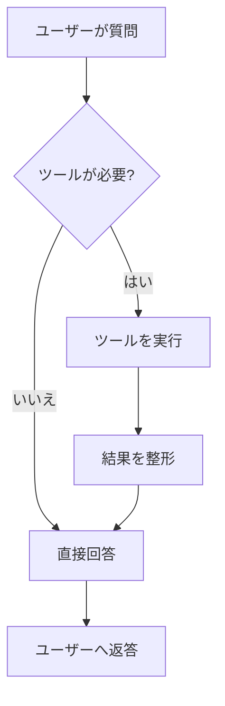
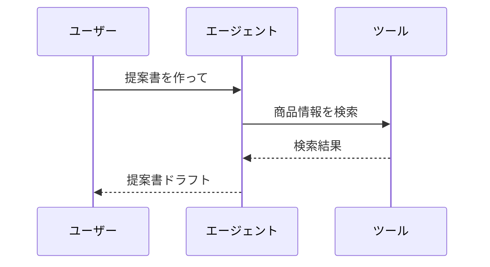
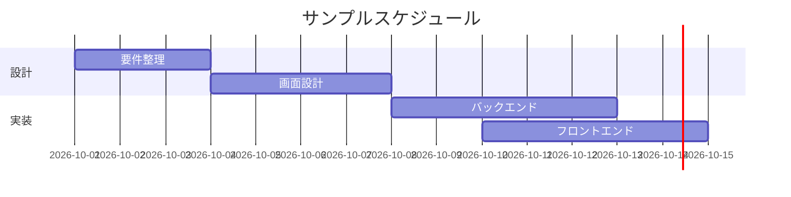
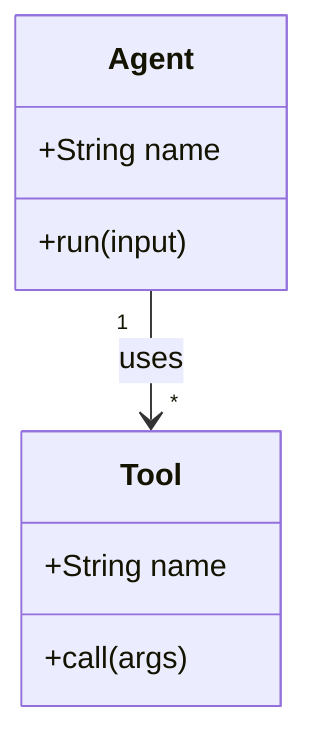
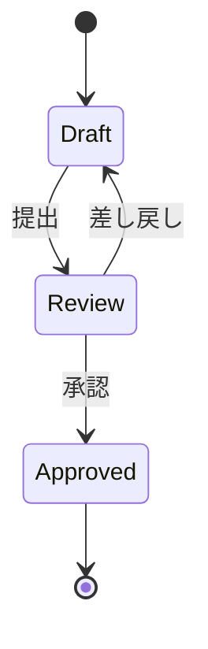
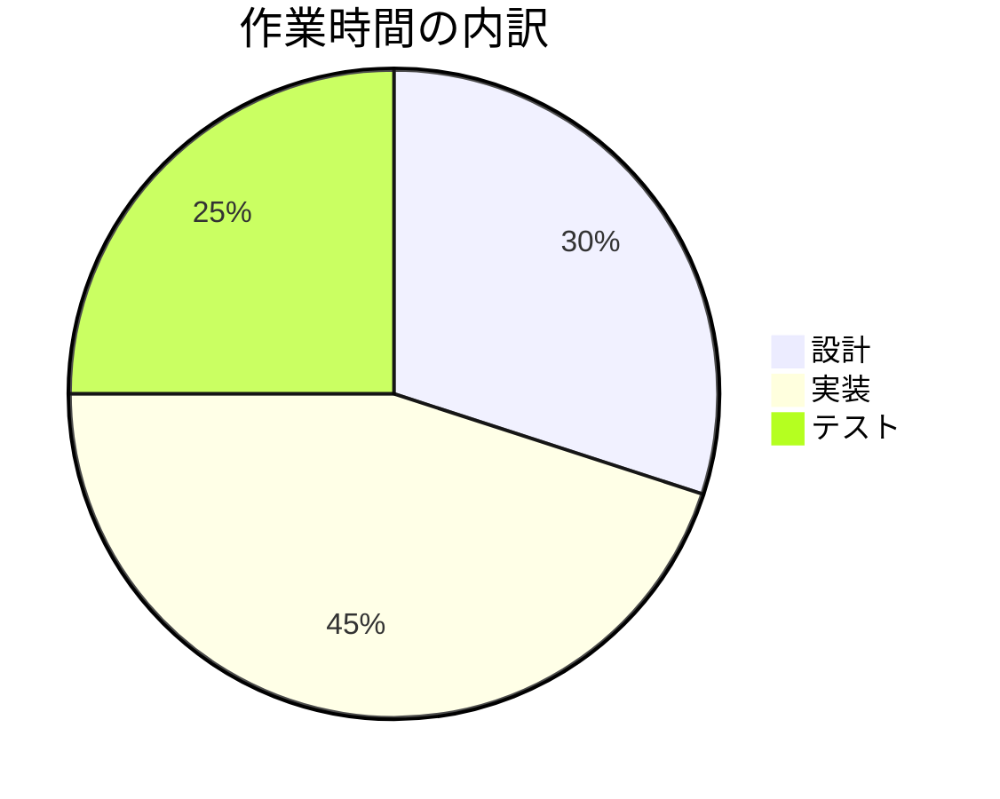

# Mermaid 表示確認用サンプル

Mermaid が正しくレンダリングされるかを確認するためのサンプルです。

## フローチャート

```mermaid
flowchart TD
    A[ユーザーが質問] --> B{ツールが必要?}
    B -- はい --> C[ツールを実行]
    B -- いいえ --> D[直接回答]
    C --> E[結果を整形]
    E --> D
    D --> F[ユーザーへ返答]
```

## シーケンス図

```mermaid
sequenceDiagram
    participant U as ユーザー
    participant A as エージェント
    participant T as ツール
    U->>A: 提案書を作って
    A->>T: 商品情報を検索
    T-->>A: 検索結果
    A-->>U: 提案書ドラフト
```

## ガントチャート

```mermaid
gantt
    title サンプルスケジュール
    dateFormat YYYY-MM-DD
    section 設計
    要件整理 :a1, 2026-10-01, 3d
    画面設計 :after a1, 4d
    section 実装
    バックエンド :2026-10-08, 5d
    フロントエンド :2026-10-10, 5d
```

## クラス図

```mermaid
classDiagram
    class Agent {
        +String name
        +run(input)
    }
    class Tool {
        +String name
        +call(args)
    }
    Agent "1" --> "*" Tool : uses
```

## 状態遷移図

```mermaid
stateDiagram-v2
    [*] --> Draft
    Draft --> Review : 提出
    Review --> Draft : 差し戻し
    Review --> Approved : 承認
    Approved --> [*]
```

## 円グラフ

```mermaid
pie title 作業時間の内訳
    "設計" : 30
    "実装" : 45
    "テスト" : 25
```
