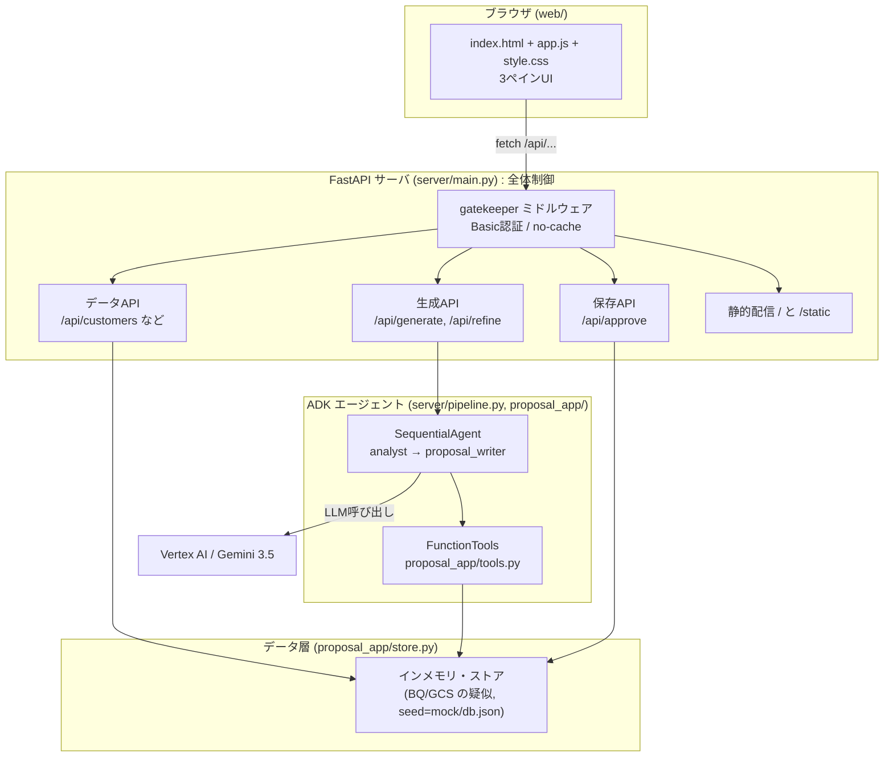
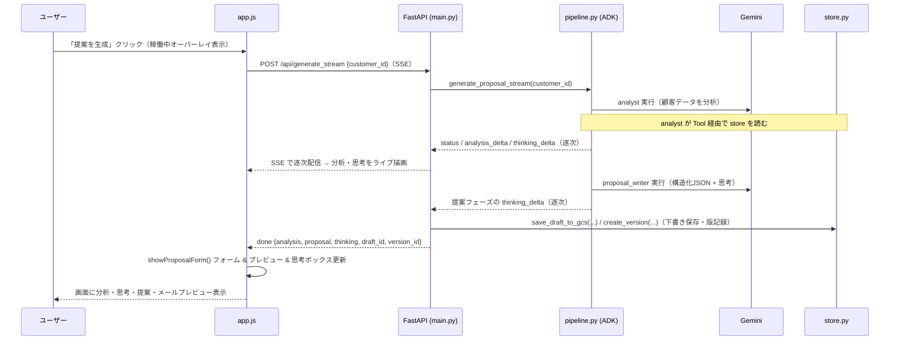

# 顧客提案ジェネレーター 完全解説（教材）

Google **ADK（Agent Development Kit）** × **Gemini 3.5** × **FastAPI** × **素のWeb UI** で作った、
「BQデータを見て AI が営業提案を作り、承認して保存する」学習用アプリの**全解説**です。

ADK 部分だけでなく、**全体を制御する Python（FastAPI）**、**UI を制御する HTML/JS** まで、
コードの意図と設計判断を丁寧に説明します。写経しながら読むと理解が深まります。

> このアプリはすべて**ダミーデータ**で動きます。実在の顧客情報は含みません。

---

## 目次

0. [概要 全体構成と処理の流れ（まず読む）](#0-概要-全体構成と処理の流れまず読む)
1. [このアプリで学べること](#1-このアプリで学べること)
2. [全体アーキテクチャ](#2-全体アーキテクチャ)
3. [ディレクトリ構成](#3-ディレクトリ構成)
4. [Part 1: ADK 編（エージェント設計）](#4-part-1-adk-編エージェント設計)
5. [Part 2: データ層 編（store.py / tools.py）](#5-part-2-データ層-編storepy--toolspy)
6. [Part 3: サーバ 編（FastAPI = 全体制御）](#6-part-3-サーバ-編fastapi--全体制御)
7. [Part 4: UI 編（HTML / CSS / JS）](#7-part-4-ui-編html--css--js)
8. [Part 5: リクエストが一周する流れ](#8-part-5-リクエストが一周する流れ)
9. [Part 6: デプロイ 編（Cloud Run）](#9-part-6-デプロイ-編cloud-run)
10. [Part 7: コスト（どの操作で Gemini が呼ばれるか）](#10-part-7-コストどの操作で-gemini-が呼ばれるか)
11. [Part 8: セキュリティと運用の注意](#11-part-8-セキュリティと運用の注意)
12. [Part 9: 発展課題](#12-part-9-発展課題)
13. [用語集](#13-用語集)
14. [付録A json-server とは](#14-付録a-json-server-とは)

---

## 0. 概要 全体構成と処理の流れ（まず読む）

細部に入る前に、まず全体像をざっくり掴みましょう（詳細は各Partで説明します）。

### このアプリは何をする？

BQ（風）の顧客データを見て、**AI（Gemini）が「その顧客向けの営業提案メール」を作成**し、
人が確認・修正して保存する——という営業支援の一連の流れを体験できるアプリです。

### 登場するのは4つの部品だけ

| 部品 | 役割 | 対応ファイル |
|---|---|---|
| ① ブラウザUI | 画面表示・ユーザー操作 | `web/` |
| ② FastAPIサーバ | 全体制御（司令塔） | `server/main.py` |
| ③ ADKエージェント | AIによる分析・作文 | `server/pipeline.py`, `proposal_app/` |
| ④ データ層 | 顧客/商品/提案の保管（BQ/GCSの疑似） | `proposal_app/store.py` |

`①ブラウザ → ②サーバ → （③AI / ④データ）` という一方向の流れです。
ブラウザは**②のサーバとだけ**会話し、AIやデータには直接触れません。

### 処理は大きく2種類しかない

| 種別 | 内容 | AI(Gemini) | 速度/課金 |
|---|---|---|---|
| **(A) データ系** | 顧客一覧・詳細の閲覧、保存済み提案の表示、承認して保存 | ❌ 使わない | 速い・無料 |
| **(B) 生成系** | 「✨提案を生成」「🔄再提案」 | ✅ 使う | 数秒・課金 |

「AIを使うのは生成/再提案の2操作だけ」と覚えると、コストも動きも理解しやすくなります。

### ざっくりの流れ

```
顧客を選ぶ ──(A)──▶ 画面にデータ表示（顧客属性・購買履歴・保存済み提案）
   │
   ├─「✨生成」─(B)─▶ ②サーバが③AIを起動 ─▶ Gemini ─▶ 分析＋提案が返る ─▶ 画面表示
   │        └ 気に入らなければ「🔄再提案」で指示を出して作り直し (B)
   │
   ├─ 手で微修正（タイトル / 本文 / おすすめ商品の並べ替え）… AI不要
   │
   └─「✅承認」─(A)─▶ ④データ層に保存（新規 or 上書き）
```

これだけ掴めれば十分です。あとは各部品の中身を Part 1〜4 で掘り下げていきます。

---

## 1. このアプリで学べること

| テーマ | 具体的に |
|---|---|
| **ADK の中核** | `LlmAgent`、`FunctionTool`、`SequentialAgent`、`Runner`、`session.state` |
| **エージェント連携の2パターン** | **サブエージェント**（`sub_agents`/委譲）と **Toolエージェント**（`AgentTool`/agent-as-tool） |
| **構造化出力** | `output_schema` で LLM の出力を JSON に固定し、UIで扱いやすくする |
| **全体制御（Python）** | FastAPI でUI配信・API・エージェント実行・認証をまとめる設計 |
| **UI 制御（JS）** | 状態管理、XSS対策付き Markdown描画、ドラッグ&ドロップ、可変ペイン |
| **本番化** | 1コンテナ化、Cloud Run デプロイ、Basic認証、コスト設計 |

---

## 2. 全体アーキテクチャ

**1プロセス**で完結します（本番の Cloud Run も同じ構成 = 1コンテナ1ポート）。



ポイント：
- フロントは**同一オリジンの `/api/...` だけ**を見る → CORS 不要でシンプル。
- **Gemini を呼ぶのは生成/再提案の2つだけ**。データ参照・保存は `store.py` で完結（＝課金が読みやすい）。
- データ層を `store.py` に隔離してあるので、後で**本物の BigQuery/GCS に差し替え**ても上位は無改修。

---

## 3. ディレクトリ構成

```
agent/
├─ proposal_app/            … ADKエージェント + データ層
│  ├─ agent.py              … root: Orchestrator（adk web 用の会話型）
│  ├─ sub_agents/
│  │  ├─ analyst.py         … 分析エージェント（Toolエージェントとして使用）
│  │  └─ proposal_writer.py … 提案エージェント（サブエージェントとして使用）
│  ├─ tools.py              … FunctionTool 群（BQ/GCS 相当の操作）
│  ├─ store.py              … データ層（インメモリ, seed=mock/db.json）
│  ├─ schemas.py            … 構造化出力スキーマ（ProposalOut）
│  └─ config.py             … モデルID等
├─ server/                  … Webアプリ（全体制御）
│  ├─ main.py               … FastAPI（UI配信 / API / 認証）
│  └─ pipeline.py           … Web用の決定論パイプライン（分析→提案）
├─ web/                     … フロントエンド
│  ├─ index.html            … 3ペインの骨組み
│  ├─ app.js                … 画面制御ロジック
│  └─ style.css             … スタイル（可変ペイン等）
├─ mock/db.json             … ダミーデータ（顧客/商品/購買/下書き/提案）
├─ Dockerfile               … Cloud Run 用
└─ requirements.txt
```

> `proposal_app/agent.py`（`adk web` 用）と `server/pipeline.py`（Web UI 用）は**別の入口**です。
> 詳しくは Part 1 の「2つの実行経路」で説明します。

---

## 4. Part 1: ADK 編（エージェント設計）

### 4-1. LlmAgent = 「指示 + モデル + 道具」を持つAI

ADK の最小単位が `LlmAgent`。**instruction（役割の指示）**、**model**、**tools（使える道具）**を持ちます。

```python
# proposal_app/sub_agents/analyst.py（抜粋）
analyst_agent = LlmAgent(
    name="analyst",
    model=MODEL,                        # 例: gemini-3.5-flash
    description="顧客データを分析して要約する分析専門エージェント。",
    instruction="""あなたは優秀なB2Bデータアナリストです。
1. get_customer_detail で顧客属性を取得
2. get_purchase_history で購買履歴を取得
3. list_products で商品カタログを把握
これらのデータを根拠に … 提案文そのものは書かないこと。""",
    tools=[get_customer_detail, get_purchase_history, list_products],
)
```

- `description` は**他のエージェントから見た「この子は何ができるか」**の説明。委譲やagent-as-toolの判断材料になる。
- `instruction` は**そのエージェント自身への行動指示**。

### 4-2. Tool（FunctionTool）= ただのPython関数

ADK では**型ヒントと docstring 付きの普通の関数**をそのまま `tools=[...]` に渡せます。
自動的に `FunctionTool` にラップされます。

```python
# proposal_app/tools.py（抜粋）
def get_customer_detail(customer_id: str) -> dict:
    """指定した顧客IDの詳細を取得する（BQの customers テーブル相当）。

    Args:
        customer_id: 顧客ID（例: "C001"）。
    Returns:
        顧客1件の詳細レコード。存在しない場合は {"error": ...}。
    """
    c = store.get_customer(customer_id)
    return c if c else {"error": f"customer_id={customer_id} が見つかりません"}
```

**超重要**：この **docstring と型ヒントが、そのまま LLM に渡る「道具の説明書」**になります。
LLM は説明書を読んで「いつ・どの引数で呼ぶか」を決めるので、docstring は丁寧に書くほど精度が上がります。

### 4-3. サブエージェント vs Toolエージェント

エージェント同士を連携させる方法は2つあり、このアプリでは**両方**を1本のワークフローで使っています。

```python
# proposal_app/agent.py（抜粋）
root_agent = LlmAgent(
    name="orchestrator",
    model=MODEL,
    instruction="""… 手順:
    2. analyst ツールを呼び分析を得る（Toolエージェント）
    3. proposal_writer に委譲して提案を作らせる（サブエージェント）
    5. 承認されたら write_proposal_to_bq で保存 …""",
    tools=[
        list_customers,
        AgentTool(agent=analyst_agent),   # ← ① Toolエージェント (agent-as-tool)
        save_draft_to_gcs, load_draft_from_gcs, write_proposal_to_bq,
    ],
    sub_agents=[proposal_writer_agent],   # ← ② サブエージェント (transfer/委譲)
)
```

| 方式 | 書き方 | 挙動 | 使いどころ |
|---|---|---|---|
| **① Toolエージェント**（agent-as-tool） | `tools=[AgentTool(agent=...)]` | **道具のように呼ぶ**。結果を受け取り、**制御は自動で親に戻る** | 「分析だけやらせて結果が欲しい」等、サブ処理を関数のように使いたいとき |
| **② サブエージェント**（委譲） | `sub_agents=[...]` | 親が**処理そのものを委譲**。会話コンテキストを引き継ぐ | 「以降の対話をこの子に任せる」等、役割を切り替えたいとき |

**覚え方**：Toolエージェントは「呼んで戻ってくる関数」、サブエージェントは「バトンを渡す」。

> 制約：同じエージェント**インスタンス**を「AgentTool」と「sub_agents」の両方に入れることはできません
> （親が二重になる）。だから `analyst` は AgentTool 専用、`proposal_writer` は sub_agent 専用にしています。

### 4-4. SequentialAgent（決定論パイプライン）と state

`adk web` の会話型 orchestrator は「LLM が手順を判断」しますが、**Web UI では毎回同じ手順で確実に動いてほしい**。
そこで Web 用には **`SequentialAgent`** で「分析 → 提案」を**必ずこの順**で実行します。

```python
# server/pipeline.py（抜粋）
proposal_pipeline = SequentialAgent(
    name="proposal_pipeline",
    sub_agents=[_build_analyst(), _build_proposal_writer()],  # 上から順に実行
)
```

各エージェントの出力は **`output_key`** で `session.state` に保存され、次のエージェントが読めます。

```python
_build_analyst():         LlmAgent(..., output_key="analysis")   # 出力を state["analysis"] へ
_build_proposal_writer(): LlmAgent(..., output_key="proposal")   # 出力を state["proposal"] へ
```

- analyst が `state["analysis"]` に分析を残す
- proposal_writer は**直前の会話（分析結果）を踏まえて**提案を作り、`state["proposal"]` に残す

### 4-5. output_schema（構造化出力）

UI で表示するには、提案が**決まった形の JSON**だと扱いやすい。そこで `output_schema` を使います。

```python
# proposal_app/schemas.py
class ProposalOut(BaseModel):
    title: str
    body: str
    recommended_product_ids: list[str]

# server/pipeline.py
_build_proposal_writer(): LlmAgent(..., output_schema=ProposalOut, output_key="proposal")
```

これで LLM は**必ず `{title, body, recommended_product_ids}` の JSON**を返すよう制御されます（パース不要）。

> **重要な制約**：`output_schema` を付けたエージェントは **tools を使えません**（構造化出力とツール呼び出しは両立不可）。
> そのため「下書き保存」などの副作用は**エージェント内ではなく、呼び出し側の FastAPI で**行っています（後述）。

### 4-5b. thinking（モデルの思考プロセス）を表示する

Gemini は「最終回答」とは別に**内部推論（thinking）**を持ちます。これを見せると、
「なぜこの提案になったか」の過程を学習者が観察できます。有効化は `generate_content_config` で行います。

```python
# server/pipeline.py（analyst / proposal_writer の両方に付与）
generate_content_config=types.GenerateContentConfig(
    thinking_config=types.ThinkingConfig(
        include_thoughts=True,     # 思考パートを返す
        thinking_level="high",     # より深く推論（その分やや遅い）
    )
)
```

- 思考は最終回答とは別の**「思考パート」**として流れ、`part.thought=True` で見分けられます。
  だから **`output_schema`（構造化JSON出力）と併用しても両立**します——JSON本文は本文パート、
  思考は思考パートに分かれて届くためです。
- **分析（analyst）だけでなく提案（proposal_writer）も思考を出します**。生成ストリームでは
  両フェーズの思考が `thinking_delta` として順に流れ、UIの思考ボックスにライブ表示されます。
- **思考の日本語化**：既定では英語で推論しがちなので、両エージェントの `instruction` 冒頭に
  「思考も最終回答も日本語だけで／英語禁止」という言語ルールを前置きして日本語思考へ誘導しています。
  ただし**これはプロンプトによる誘導**であり、モデル依存で**完全に保証されるわけではありません**。

### 4-6. Runner でエージェントを動かす

エージェントを実際に走らせるのが `Runner`。セッションを作り、メッセージを渡し、
`run_async` でイベントを消費し、最後に `session.state` を読みます。

```python
# server/pipeline.py（抜粋・要点）
_pipeline_runner = InMemoryRunner(agent=proposal_pipeline, app_name=APP_NAME)

async def _run(runner, text):
    session = await runner.session_service.create_session(app_name=APP_NAME, user_id=USER_ID)
    message = types.Content(role="user", parts=[types.Part(text=text)])
    async for _ in runner.run_async(user_id=USER_ID, session_id=session.id, new_message=message):
        pass  # イベントは state に集約されるので消費するだけ
    final = await runner.session_service.get_session(app_name=APP_NAME, user_id=USER_ID, session_id=session.id)
    return final.state   # {"analysis": ..., "proposal": {...}}
```

### 4-7. 「初回生成」と「再提案」— 2つの関数

```python
# 初回: 分析 → 提案（フルパイプライン）
async def generate_proposal(customer_id) -> {"analysis", "proposal"}

# 再提案: 分析は再実行せず、提案だけ作り直す（速い・安い）
async def refine_proposal(customer_id, analysis, previous_proposal, instruction) -> {"analysis", "proposal"}
```

再提案では、**同じ分析を使い回す**ため analyst を動かしません。代わりに
「分析結果＋前回提案＋ユーザー指示」をメッセージに詰めて、**提案エージェント単体**を回します。

```python
# 再提案用は proposal_writer の“別インスタンス”を使う
proposal_refiner = _build_proposal_writer(name="proposal_refiner")
_refine_runner = InMemoryRunner(agent=proposal_refiner, app_name=APP_NAME)
```

> なぜ別インスタンス？ `proposal_pipeline` の中の proposal_writer は既に「親（パイプライン）」を持っています。
> 同じインスタンスを別の Runner のトップに置くと親が衝突するため、**再提案用は作り直した別個体**にしています。

なお、初回生成・再提案とも**ストリーミング版**（`generate_proposal_stream` / `refine_proposal_stream`）を
用意しています。`RunConfig(streaming_mode=StreamingMode.SSE)` で実行し、途中経過（ステータス・分析の差分・
思考の差分）を逐次 `yield` します。UIはこのストリーミング版を使い、モデルの思考をライブ表示します（後述）。

### 4-8. 2つの実行経路（まとめ）

| 経路 | 入口 | 特徴 |
|---|---|---|
| **会話型**（`adk web` で体験） | `proposal_app/agent.py` の `root_agent` | LLM が手順を判断。Toolエージェント＋サブエージェント＋各種Tool |
| **決定論型**（Web UI が使用） | `server/pipeline.py` | 毎回同じ順で確実に実行。構造化出力でUI向き |

同じ「分析→提案」でも、**用途に応じて2つの組み立て方**を用意しているのがこのアプリの学びどころです。

---

## 5. Part 2: データ層 編（store.py / tools.py）

### 5-1. store.py = 「BQ/GCS のフリをする」インメモリDB

本来 BigQuery / GCS を叩く部分を、学習用に**同一プロセス内の辞書**で疑似化しています。

```python
# proposal_app/store.py（要点）
_DB_PATH = ... / "mock" / "db.json"       # 起動時の種データ
_data = None                              # メモリ上の状態

def list_customers(): ...                 # 参照
def get_customer(id): ...
def list_proposals(customer_id=None): ... # customer_id で絞り込み可
def create_draft(rec): ...                # 下書き作成（id 自動採番）
def create_proposal(rec): ...             # 提案作成
def update_proposal(id, rec): ...         # 提案更新
```

- 起動時に `mock/db.json` を読み込み、以後はメモリ上で読み書き。
- **注意**：インメモリなので**再起動・スケールで初期状態に戻ります**。
  永続化したい場合は、この関数群の中身を **GCS / Firestore / BigQuery** に差し替えればOK
  （呼び出し側の tools.py・main.py は無改修）。これが「データ層を隔離する」設計の利点。

### 5-2. tools.py = LLM から見える操作 & アプリから見えるAPI

`tools.py` は `store.py` を薄くラップし、**2つの顔**を持ちます。

1. **ADK の Tool**として LLM が呼ぶ（`get_customer_detail` 等、docstring が説明書）
2. **FastAPI から**も同じ関数を呼ぶ（データAPIの実体）

```python
def save_draft_to_gcs(customer_id, title, body, recommended_product_ids) -> dict:
    """提案の下書きを一時保存する（GCSにJSONを置く相当）。…"""
    saved = store.create_draft({...})
    return {"draft_id": saved.get("id"), "saved": saved}
```

> 命名が `..._to_gcs` / `..._to_bq` なのは、「本来どのサービスに対応するか」を**教材的に明示**するため。
> 中身は今は store.py ですが、名前が差し替え先を示しています。

---

## 6. Part 3: サーバ 編（FastAPI = 全体制御）

`server/main.py` が**アプリの司令塔**。UI配信・データAPI・生成API・保存API・認証を1つにまとめます。

### 6-1. エンドポイント一覧

| メソッド & パス | 役割 | Gemini |
|---|---|---|
| `GET /` | `index.html` を返す | ❌ |
| `GET /static/*` | JS/CSS を返す | ❌ |
| `GET /api/customers` | 顧客一覧 | ❌ |
| `GET /api/customers/{id}` | 顧客詳細 | ❌ |
| `GET /api/customers/{id}/purchases` | 購買履歴 | ❌ |
| `GET /api/products` | 商品カタログ | ❌ |
| `GET /api/proposals?customer_id=` | 保存済み提案（顧客で絞込） | ❌ |
| `GET /api/versions?customer_id=` | 生成/再提案の版履歴（顧客で絞込） | ❌ |
| `POST /api/generate` | **分析→提案生成** + 下書き保存（非ストリーム） | ✅ |
| `POST /api/generate_stream` | 生成をSSEでストリーミング（status / analysis_delta / **thinking_delta** / done） | ✅ |
| `POST /api/refine` | **再提案**（指示反映） + 下書き保存（非ストリーム） | ✅ |
| `POST /api/refine_stream` | 再提案をSSEでストリーミング（status / **thinking_delta** / done） | ✅ |
| `POST /api/evaluate` | 提案を LLM-as-judge で採点 | ✅ |
| `POST /api/approve` | 提案を保存（新規 or 上書き） | ❌ |
| `DELETE /api/proposals/{id}` `DELETE /api/versions/{id}` | 保存済み提案 / 版の削除 | ❌ |

> `/api/generate` と `/api/refine`（非ストリーム版）のレスポンスにも、生成結果に対応する
> **モデルの思考テキスト `thinking`** が含まれます。ストリーミング版では `thinking_delta` で逐次流れ、
> 最後の `done` に確定値がまとまって入ります。UI が実際に使うのは**ストリーミング版**です。

### 6-2. リクエストの型（Pydantic）

FastAPI は Pydantic モデルで**入力を自動検証**します。

```python
class ApproveReq(BaseModel):
    customer_id: str
    title: str
    body: str
    recommended_product_ids: list[str]
    proposal_id: int | None = None   # あり=更新 / なし=新規
```

`/api/approve` は `proposal_id` の有無で**新規作成(INSERT)か上書き(UPDATE)か**を自動分岐します。

```python
if req.proposal_id is not None:
    return tools.update_proposal_in_bq(proposal_id=str(req.proposal_id), ...)
return tools.write_proposal_to_bq(...)
```

### 6-3. 生成API — output_schema の制約を回収する場所

Part 1 で「構造化出力エージェントは tools を使えない」と述べました。
その分の**副作用（下書き保存）を FastAPI 側で実行**しています。

```python
@app.post("/api/generate")
async def api_generate(req):
    result = await generate_proposal(req.customer_id)   # ← ADK（LLM）
    proposal = result.get("proposal") or {}
    draft = tools.save_draft_to_gcs(...)                # ← 副作用はここで（GCS相当）
    return {"analysis": ..., "proposal": proposal, "draft_id": draft.get("draft_id")}
```

> **設計の型**：「LLM は考える（分析・作文）だけ」「保存などの副作用はアプリ側」。
> こうすると LLM の出力を検証してから保存でき、安全で制御しやすくなります。

### 6-4. gatekeeper ミドルウェア（認証 + キャッシュ制御）

全リクエストを通す**ミドルウェア**で、2つの共通処理をします。

```python
@app.middleware("http")
async def gatekeeper(request, call_next):
    # 1) APP_PASSWORD があれば Basic 認証を要求
    if APP_PASSWORD:
        ok = 送られてきた Basic 認証のパスワードが一致するか
        if not ok:
            return Response(401, headers={"WWW-Authenticate": 'Basic realm="proposal"'})
    # 2) 静的ファイルはキャッシュ無効（UI編集が即反映される）
    response = await call_next(request)
    if request.url.path == "/" or path.startswith("/static"):
        response.headers["Cache-Control"] = "no-store"
    return response
```

- `secrets.compare_digest` を使うのは**タイミング攻撃対策**（比較時間を一定にする）。
- `APP_PASSWORD` 環境変数が**未設定ならノーガード**（ローカル開発は楽に、公開時だけ有効化）。
- `no-store` は開発中の「JSを直したのにブラウザが古いのを使う」問題を防ぎます。

### 6-5. 環境変数 / .env

```
GOOGLE_GENAI_USE_VERTEXAI=TRUE   # Vertex AI 経由で Gemini を使う
GOOGLE_CLOUD_PROJECT=your-project-id
GOOGLE_CLOUD_LOCATION=global
GEMINI_MODEL=gemini-3.5-flash
APP_PASSWORD=...                 # 任意。設定すると Basic 認証が有効
```

ローカルは `proposal_app/.env`（gitignore 済み）で読み込み、Cloud Run では**デプロイ時に直接**設定します。

---

## 7. Part 4: UI 編（HTML / CSS / JS）

**依存ライブラリゼロ**（フレームワーク不使用）の素の HTML/CSS/JS です。基本を学ぶのに最適。

### 7-1. index.html — 3ペインの骨組み

```
header.topbar        … タイトル + ☰（左ペイン開閉ボタン）
main.layout          … CSS Grid の3カラム
  section.customers        … 左: 顧客一覧
  div#splitter-left        … 仕切り（ドラッグで幅調整）
  section.detail           … 中央: 詳細 + 分析 + 提案“編集フォーム”
  div#splitter-right       … 仕切り
  section.preview-pane     … 右: メールプレビュー（固定表示）
```

中央の `#result` の中に「分析結果カード」と「提案編集フォーム」があり、
提案は**表示専用ではなく入力フォーム**（`<input>` / `<textarea>` / チェックボックス）です。

### 7-2. app.js — 状態変数（ここが心臓部）

```js
let productsById = {};        // 商品ID → 商品（表示用の辞書）
let currentCustomer = null;   // 選択中の顧客
let currentProposalId = null; // null=新規 / 数値=既存BQ提案を編集中
let currentAnalysis = "";     // 直近の分析（再提案で使い回す）
let currentOrder = [];        // 推奨商品の“表示順”（D&Dの結果の真実）
```

この**5つの状態**でUI全体が回ります。特に `currentOrder`（並び順）と `currentProposalId`（新規/更新の区別）が肝。

### 7-3. api() ヘルパと画面遷移

```js
async function api(path, options) {
  const res = await fetch(path, options);
  if (!res.ok) throw new Error(`${res.status} ...`);
  return res.json();
}
```

- 起動 `init()` → 商品と顧客を読み込む
- 顧客クリック `selectCustomer()` → 詳細・購買履歴・保存済み提案を読み、状態をリセット
- 生成/再提案/編集 → **`showProposalForm()` に集約**（フォームとプレビューを同じ関数で描画）

### 7-4. Markdown → HTML（XSS対策込み）

分析結果は Markdown で返るので、HTMLに変換して表示します。**ブラウザは Markdown を解釈しない**ため必須の処理。

```js
function escapeHtml(s){ return s.replace(/&/g,"&amp;").replace(/</g,"&lt;").replace(/>/g,"&gt;"); }
function renderMarkdown(md){
  const lines = escapeHtml(md).split(/\r?\n/);  // ★先にエスケープ→その後に変換
  // 見出し #～###### / 箇条書き -,* / **太字** / `コード` / 段落 を <h>,<ul>,<strong>… へ
}
```

**急所**：`innerHTML` を使う前に**必ず `escapeHtml` でエスケープ**しています。
LLM出力をそのまま `innerHTML` に入れると `<script>` が実行され得る（XSS）。
先にエスケープしておけば、`<script>` は**ただの文字**として表示され無害化されます。

### 7-5. 商品サムネイル（画像ファイル不要）

商品画像は**その場で SVG を生成**して `data:` URI として埋め込みます（ネット・画像ファイル不要）。

```js
function productImageDataUri(p) {
  const s = categoryStyle(p.category);        // カテゴリ別の色とアイコン絵文字
  const svg = `<svg …><rect fill='url(#g)'/><text>${s.icon}</text></svg>`;
  return "data:image/svg+xml;charset=utf-8," + encodeURIComponent(svg);
}
```

### 7-6. メールプレビュー & ドラッグ&ドロップ並べ替え

`currentOrder`（配列）が**推奨商品の並び順の唯一の真実**です。

```js
function renderPreviewProducts() {
  currentOrder.forEach((id, idx) => {
    const tile = /* +名前+価格 のカード */;
    tile.draggable = true;
    tile.addEventListener("dragstart", …);  // dragIndex = idx を記録
    tile.addEventListener("dragover",  e => e.preventDefault()); // ドロップ許可
    tile.addEventListener("drop", e => {
      const moved = currentOrder.splice(from, 1)[0];  // 配列から抜いて
      currentOrder.splice(to, 0, moved);              // 落とした位置へ挿入
      renderPreviewProducts();                        // 再描画
    });
  });
}
```

HTML5 Drag and Drop の要点：**`dragover` で `preventDefault()` しないと `drop` が発火しない**（既定はドロップ禁止）。

### 7-7. チェックボックス ↔ 並び順の同期

- 下段の**チェックボックス**＝どの商品を推奨に含めるか（選択）
- 上段の**プレビュー**＝並び順（D&D）

チェックの変更で `currentOrder` に追加/除去し、プレビューを再描画。
保存時は `getFormProposal()` が **`currentOrder` の順**で `recommended_product_ids` を返すので、
**D&Dの並びがそのまま保存**されます。

```js
function getFormProposal() {
  return {
    title: 値, body: 値,
    recommended_product_ids: [...currentOrder],  // ← 並び順が保存に反映
  };
}
```

### 7-8. 新規/更新の分岐（承認）

```js
async function approve() {
  const saved = await api("/api/approve", { method:"POST",
    body: JSON.stringify({ ..., proposal_id: currentProposalId }) });  // null=新規 / 数値=更新
  currentProposalId = saved.proposal_id;   // 保存後は“その提案を編集中”に
  updateEditBadge();                        // バッジを「編集中」に更新
}
```

`editSavedProposal()` で保存済みを開くと `currentProposalId` に id が入り、
以後の承認は**上書き更新**になります（重複を作らない）。

### 7-9. 可変ペイン & 左ペイン開閉（CSS変数 + localStorage）

幅は **CSS変数**で持ち、仕切りのドラッグで変数を書き換えます。

```css
.layout {
  --left-w: 280px; --right-w: 400px; --sp: 8px;
  grid-template-columns: var(--left-w) var(--sp) minmax(0,1fr) var(--sp) var(--right-w);
}
.layout.left-collapsed { grid-template-columns: 0 0 minmax(0,1fr) var(--sp) var(--right-w); }
```

```js
function initSplitter(id, varName, sign, min, max) {
  el.addEventListener("pointerdown", e => {
    // ドラッグ量から新しい幅を計算し、clamp して CSS変数へ
    layoutEl.style.setProperty(varName, w + "px");
    // 離したら localStorage に保存（次回復元）
  });
}
initSplitter("splitter-left",  "--left-w",  +1, 180, 520);
initSplitter("splitter-right", "--right-w", -1, 300, 680);  // 右は符号 -1（右へ動かすと縮む）
```

- `sign` で「ドラッグ方向」と「幅の増減」を対応づけ（右仕切りは右へ動かすと右ペインが**縮む**ので `-1`）。
- 幅・開閉状態は **localStorage** に保存 → リロードしても維持。

### 7-10. ストリーミング表示：稼働中インジケータ & 思考ボックス

生成・再提案は SSE（`/api/generate_stream` `/api/refine_stream`）を `fetch` で読み、
`ReadableStream` を1メッセージずつ処理して画面を**逐次更新**します。

```js
const { event, data } = parseSSEChunk(chunk);   // event: 種別, data: JSON
if (event === "thinking_delta") { thinkingAcc += data.text; /* 思考ボックスへ追記 */ }
```

- **モデル稼働中インジケータ**：`#activity` は**画面に固定したオーバーレイ**（スピナー＋状態文）で、
  生成・再提案の**両方**で表示します。`position: fixed` なので**スクロール位置に関係なく常に見えます**。
  `showActivity()` / `setActivityStatus()` / `hideActivity()` で制御します。
- **🧠 思考ボックス**：分析結果カードの**すぐ下**に置き（`#thinking-box`）、`thinking_delta` を
  Markdown 描画でライブ追記します。思考があるときは**既定で開いた状態**（`details.open = true`）で表示し、
  クリックで畳めます。版を復元したときも、その版に保存された思考を同じ枠に表示します。

### 7-11. 会話の流れ（各ターンの思考を併記）

再提案は「会話の継続」なので、初回生成＋各再提案を**1ターンずつ**下に積んで見せます（`conversationLog`）。

```js
let conversationLog = []; // [{kind:'generate'|'refine', instruction, thinking}]
```

各ターンには、そのターンで使われた**モデルの思考**が
折りたたみ「🧠 このターンの思考プロセス」として対応表示されます。
「どの指示が、どんな思考を経て、どの提案になったか」を後から追えるのが狙いです。

### 7-12. 生成履歴（版）は既定で折りたたみ

版管理（生成/再提案の記録・復元・2件比較）は情報量が多いため、
`<details class="card history">` に入れて**既定は閉じた状態**にし、必要なときだけ開くようにしています。

### 7-13. モバイルの「PC版で表示」トグル

このUIはデスクトップの3ペイン前提です。物理画面が小さい端末では**「🖥️ PC版で表示」トグル**を出し、
`<meta name="viewport">` を「`width=device-width`（モバイル最適化）」と「固定幅（デスクトップ相当）」で
切り替えられます。選択は **localStorage** に保存され、次回も維持されます。

```js
viewportMeta.setAttribute("content", desktop ? VIEWPORT_DESKTOP : VIEWPORT_MOBILE);
```

> あくまで**表示幅の切り替え**であり、タッチ操作のD&D最適化などモバイル専用対応は今後の課題です。

---

## 8. Part 5: リクエストが一周する流れ

「✨提案を生成」を押してから画面に出るまで（end-to-end）：



**承認**はもっと単純で、`POST /api/approve` → `store` に保存 → 画面の「保存済み提案」を再読込、で完結（LLM なし）。

---

## 9. Part 6: デプロイ 編（Cloud Run）

### 9-1. なぜ1コンテナ化したか

Cloud Run は「1コンテナ・1ポート」で動きます。開発初期は「FastAPI + json-server」の**2プロセス**でしたが、
デプロイのために **json-server を廃止し、データ層を `store.py` として FastAPI に内蔵**しました。
結果、ローカルもクラウドも**単一プロセス**でシンプルに。
（json-server が何か・どう使うかは → [付録A](#14-付録a-json-server-とは)）

### 9-2. Dockerfile

```dockerfile
FROM python:3.12-slim
WORKDIR /app
COPY requirements.txt ./
RUN pip install -r requirements.txt
COPY . ./
ENV PORT=8080
CMD exec uvicorn server.main:app --host 0.0.0.0 --port ${PORT}   # Cloud Run は $PORT を注入
```

### 9-3. デプロイ手順（要点）

```bash
# 実行SAに Vertex 権限（初回のみ）
gcloud projects add-iam-policy-binding your-project-id \
  --member="serviceAccount:<PROJECT_NUMBER>-compute@developer.gserviceaccount.com" \
  --role="roles/aiplatform.user"

# デプロイ（Cloud Build がビルド。ローカルDocker不要）
gcloud run deploy proposal-app --source . --region asia-northeast1 \
  --allow-unauthenticated --concurrency=3 --max-instances=1 --memory=512Mi \
  --set-env-vars GOOGLE_GENAI_USE_VERTEXAI=TRUE,GOOGLE_CLOUD_PROJECT=your-project-id,GOOGLE_CLOUD_LOCATION=global,GEMINI_MODEL=gemini-3.5-flash,APP_PASSWORD=<強いパスワード>
```

- **認証**：Cloud Run上では ADC（実行サービスアカウント）で Vertex を叩くので、鍵ファイルは不要。
- **min-instances=0（既定）**：アイドル時はゼロにスケール → 待機課金なし（初回はコールドスタート）。
- **`--allow-unauthenticated` + APP_PASSWORD**：URLは公開だが、実アクセスは**アプリのBasic認証**で制限。

### 9-4. 一時休止と再開（IAM）

```bash
# 休止：一般公開(allUsers)を外す → 誰も到達不可（403）
gcloud run services remove-iam-policy-binding proposal-app --region asia-northeast1 \
  --member=allUsers --role=roles/run.invoker

# 再開：戻す
gcloud run services add-iam-policy-binding proposal-app --region asia-northeast1 \
  --member=allUsers --role=roles/run.invoker
```

休止中は Cloud Run 層でリクエストが弾かれ、**アプリにも Gemini にも到達しない**＝課金ゼロ。

---

## 10. Part 7: コスト（どの操作で Gemini が呼ばれるか）

| 操作 | Gemini 呼び出し | 課金 |
|---|---|---|
| ページ表示・顧客切替・保存済み閲覧・**編集・D&D** | ❌ なし | なし |
| **✨提案を生成** / **🔄再提案** | ✅ あり | 回数分 |
| ✅承認して保存 | ❌ なし | なし |

**設計思想**：LLM を呼ぶのは「明示的なボタン操作」だけ。
「ページを開いた瞬間に自動生成」にすると表示＝課金になるため、**あえてボタン起点**にしています。

---

## 11. Part 8: セキュリティと運用の注意

- **秘密情報をコミットしない**：`.env`・`.adk/`・`.venv` は `.gitignore` 済み。公開リポジトリと分離。
- **Basic認証は簡易策**：本格運用なら Cloud Run IAM 認証や IAP（Identity-Aware Proxy）を検討。
- **XSS**：LLM やユーザー入力を `innerHTML` する際は必ずエスケープ（本アプリは対応済み）。
- **インメモリの限界**：再起動でデータが消える。永続化は `store.py` を実ストアに差し替え。
- **コスト暴走の防止**：公開URL＋LLM は必ずパスワードで保護。`max-instances` で上限も設定。

---

## 12. Part 9: 発展課題

1. **本物の BigQuery / GCS 化** … `store.py` を実SDK実装に差し替え（上位は無改修）。
2. **ストリーミング表示** … `run_sse` で分析→提案の生成過程をリアルタイム描画。
3. **会話の継続** … 「さっきの案をベースにさらに〜」を state で引き継ぐ。
4. **提案の版管理** … 生成/再提案ごとに履歴を残して見比べる。
5. **評価（Eval）** … ADK の評価機能で提案品質を自動テスト。
6. **本物の商品画像** … `products` に画像URL/データを持たせてサムネイル差し替え。

---

## 13. 用語集

| 用語 | 意味 |
|---|---|
| **ADK** | Agent Development Kit。Googleのエージェント開発フレームワーク。 |
| **LlmAgent** | 指示・モデル・道具を持つ最小のAIエージェント。 |
| **FunctionTool** | Python関数をLLMの「道具」にしたもの。docstringが説明書。 |
| **サブエージェント** | `sub_agents` に登録し、親が処理を委譲(transfer)する子エージェント。 |
| **Toolエージェント** | `AgentTool` でラップし、道具のように呼ぶエージェント（agent-as-tool）。 |
| **SequentialAgent** | 子エージェントを上から順に実行する決定論的エージェント。 |
| **output_key** | エージェントの出力を `session.state` に保存するキー名。 |
| **output_schema** | LLM出力を固定JSON形に制御する仕組み（ツール併用不可）。 |
| **Runner** | エージェントを実行し、セッション/状態を管理する実行器。 |
| **Vertex AI** | GCP上でGeminiを使うためのプラットフォーム。 |
| **Cloud Run** | コンテナをサーバレスで公開できるGCPサービス。 |
| **Basic認証** | ユーザー名/パスワードによる最も簡素なHTTP認証。 |

---

## 14. 付録A json-server とは

> ⚠️ 現在のアプリは `store.py`（Python内メモリ）を使い、json-server は**使っていません**。
> ですが**開発初期に使っていた**ツールで、「バックエンドを書く前に、まずAPIだけ用意する」定番手法として
> 知っておくと役立つので、付録として解説します。

### json-server とは

`json-server` は、**1つの JSON ファイルを置くだけで REST API サーバになる** Node 製のツールです。
データベースやサーバのコードを一切書かずに、`GET / POST / PUT / DELETE` がすぐ使えます。
フロントエンドを先に作りたいときの**モックAPI**として定番です。

### 使い方（基本）

```bash
# インストール不要。npx で起動（Node が必要）
npx json-server@0.17.4 --watch db.json --port 3000
```

`db.json` の**トップレベルのキーが、そのままエンドポイント**になります。

```json
{
  "customers": [ { "id": "C001", "name": "..." } ],
  "products":  [ { "id": "P100", "name": "..." } ]
}
```

上の `db.json` を配信すると、次のAPIが自動で生えます。

| 操作 | 例 | 説明 |
|---|---|---|
| 一覧取得 | `GET /customers` | 配列を丸ごと返す |
| 1件取得 | `GET /customers/C001` | id で1件 |
| 絞り込み | `GET /customers?segment=SMB` | クエリで条件検索 |
| 追加 | `POST /customers` | id を自動採番して追加 |
| 更新 | `PUT /customers/1` | 1件を置き換え |
| 削除 | `DELETE /customers/1` | 1件削除 |

`--watch` を付けると `db.json` の変更を監視し、`POST` などの書き込みも**ファイルに保存**されます
（＝簡易的な永続化）。

### このプロジェクトでの立ち位置（開発初期の構成）

最初は「アプリ(FastAPI) + データ(json-server)」の**2プロセス**でした。

```
ブラウザ ──▶ FastAPI(:8000) ──▶ json-server(:3000)  ← BQ/GCS の代役
                                  /customers  = 顧客テーブル(BQ)相当
                                  /products   = 商品テーブル(BQ)相当
                                  /drafts     = 下書き(GCS)相当
                                  /proposals  = 提案テーブル(BQ)相当
```

- json-server が **BQ/GCS のフリ**をしていました。
- Tool 関数（`tools.py`）は `httpx` で `http://localhost:3000` を叩いてデータを読み書きしていました。
- 当時の起動は「ターミナルA: json-server」「ターミナルB: FastAPI」の2つが必要でした。

### なぜ store.py に置き換えたか

- **Cloud Run は「1コンテナ・1ポート」**。node(json-server) と python(FastAPI) の2プロセスを1つに詰めるのは面倒。
- そこでデータ層を **Python の同一プロセス内（`store.py`）に取り込み**、単一プロセス化しました。
- 結果、**ローカルも本番も json-server 不要**でシンプルに（起動もターミナル1つ）。
- ただし json-server は「**本物のDBが無くても、UIやToolを先に作れる**」ため、試作・学習では今も非常に有用です。

### 参考：json-server 構成に戻すには

学習として2プロセス構成を試すなら、
`tools.py` を「`store` 直呼び」から「`httpx` で `:3000` を叩く」実装に戻し、
`mock/db.json` を `json-server --watch` で配信すればOKです。
**データ層だけ差し替えれば上位（サーバ・UI・エージェント）は無改修**——という
「層を分ける設計」の効果を、身をもって体感できます。

---

*このドキュメントはアプリのソース（`proposal_app/`, `server/`, `web/`）と対応しています。*
*コードを開きながら各章を読むと、設計判断の理由まで理解できます。*
