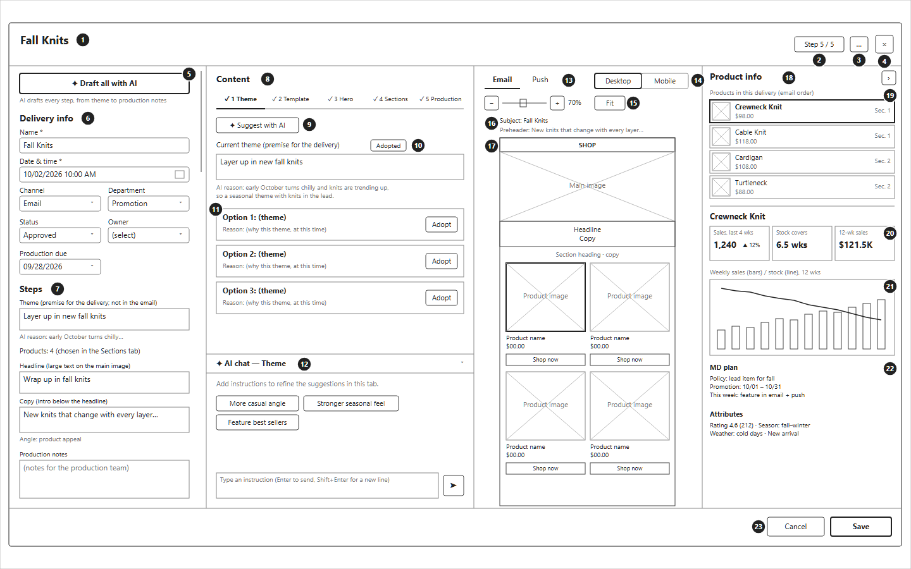

# Screen Layouts (Wireframes) — Contents Planner

## About this document

This document shows the screen layout of the Contents Planner as wireframes. It covers deliveries for the US.

- Figures: `ccp-wireframes.drawio` (draw.io, one page per screen). In Confluence, import it with the draw.io macro.
- The black numbered circles in each figure match the numbers in that screen's "Elements" table.
- The "Related user stories" column lists numbers from the user stories document (for example, `1-作3` = chapter 1, task 3; `作` = task, `確` = check).
- Text, dates, names and figures in the drawings are examples.
- The figures use lines and text only. A delivery's status (Not started / In review / Approved / Confirmed) is written as text.

### Screens

| No. | Screen | Role |
| --- | --- | --- |
| 01 | Delivery calendar | Lists the month's deliveries; the entry point for creating and opening deliveries |
| 02 | Delivery card (overall) | Builds one delivery step by step, and checks how the email and push look |

(More screens will be added.)

---

## 01 Delivery calendar

### Purpose

Lists the month's deliveries on a calendar. Shows each delivery's planning status, and is the entry point for creating and opening deliveries.

### Figure

### Elements

| No. | Element | Content and actions | Related user stories |
| --- | --- | --- | --- |
| 1 | Screen name | "Delivery Calendar". The first screen users see | `1-作1` |
| 2 | Templates | Opens template management | `7-作1` – `7-作6` |
| 3 | Display language | Switches the UI language between 日本語 and English | `1-作7` `17-作1` |
| 4 | Auto-draft on open | Whether opening an empty delivery starts an AI draft automatically (On / Off) | `4-作2` |
| 5 | New | Creates a new delivery (opens a delivery card) | `3-作1` |
| 6 | Filters | Filters by channel (Email / Push), department (Promotion / CRM / EC) and status. "All" clears a filter | `1-作3` `1-作4` |
| 7 | Count | Number of deliveries shown / total | `1-確2` |
| 8 | Month navigation | Moves to the previous or next month. The month shown is in the middle | `1-作2` |
| 9 | View | Month / Week / List. Week shows only this week and next week. List shows deliveries as a table | `1-作8` `1-作13` |
| 10 | Export | Exports the deliveries shown to a file, for sharing with stakeholders | `1-作13` |
| 11 | Status legend | The four statuses, in order of progress | `1-確1` |
| 12 | "+" on a day | Appears when hovering over a day. Creates a delivery on that day, with the current channel and department filters filled in | `1-作5` |
| 13 | Delivery | Time, status and name. Selecting it opens the delivery card | `1-作6` `1-確1` `1-確3` |
| 14 | Today | Today's date is outlined | — |

### States

- Days without deliveries show only the date.
- Several deliveries on one day are stacked in time order.
- Days of the previous and next month are shown in light text.

### Transitions

| Action | Goes to |
| --- | --- |
| Select a delivery (13) | 02 Delivery card (that delivery) |
| New (5) or "+" on a day (12) | 02 Delivery card (an empty delivery) |
| Templates (2) | Template management (to be added) |
| View (9): Week | Week view (to be added) |

---

## 02 Delivery card (overall)

### Purpose

Builds one delivery through its steps (Theme → Template → Hero → Sections → Production notes). Users review AI suggestions and their reasons, adopt or edit them, and check how the email and push look. Product info on the right gives the facts for choosing products.

The card opens over the calendar. This figure shows it with Product info open.

### Figure

### Layout

| Area | Content |
| --- | --- |
| Top | Delivery name, step progress, menu, close |
| Left | Delivery info and a summary of each step (scrolls vertically) |
| Middle | Content for each step (switched by tabs), and AI chat |
| Right | Preview (Email / Push) |
| Right edge | Product info (collapsible) |
| Bottom | Cancel and Save |

### Elements

| No. | Element | Content and actions | Related user stories |
| --- | --- | --- | --- |
| 1 | Delivery name | The name of the delivery | `3-作1` |
| 2 | Step progress | How many of the five steps are done (for example, Step 5 / 5) | `3-確1` `3-確2` |
| 3 | Menu | Duplicate (for another day), delete or cancel, change history | `3-作4` `3-作5` `3-確4` |
| 4 | Close | Closes the card (asks for confirmation if there are unsaved changes) | `3-作2` |
| 5 | Draft all with AI | AI drafts everything in order: theme → template and main image → headline and copy → each section → production notes. While running, it shows which step is in progress | `4-作1` `4-確1` `4-確3` |
| 6 | Delivery info | Name and date & time (required), channel, department, status, owner, production due date | `3-作1` `3-作6` `3-作7` |
| 7 | Step summary | Theme and its reason, number of products, headline, copy and angle, production notes. Shows everything adopted in one place | `3-確1` `3-確3` |
| 8 | Step tabs | 1 Theme, 2 Template, 3 Hero, 4 Sections, 5 Production. Finished steps are checked (✓) | `3-確2` |
| 9 | Suggest with AI | AI suggests options for the open step (three for the theme) | `5-作1` |
| 10 | Current content | The adopted option (editable) and the AI's reason | `5-作3` `5-確2` `3-確3` |
| 11 | Options | The AI's options, each with a reason. "Adopt" moves it into 10 | `5-作2` `5-確1` |
| 12 | AI chat | Adds instructions for the open step. Common requests are buttons. Collapsible | `5-作4` `13-作1` `13-作2` `13-確1` |
| 13 | Email / Push | Switches the preview between the email and the push notification | `15-作1` `16-確1` |
| 14 | Desktop / Mobile | Switches how the email is shown: desktop or smartphone | `15-作5` |
| 15 | Zoom | Zooms in and out. "Fit" shows the whole email | `15-作2` |
| 16 | Subject and preheader | The email subject and the short text shown in the inbox | `9-作5` |
| 17 | Preview | Lays out the main image, headline and copy, sections and products (image, name, price, button) as the template defines. Products can be reordered or removed, and text edited, on the preview | `15-作3` `15-確1` – `15-確3` |
| 18 | Product info | Panel with the facts for choosing products. "›" collapses it | `12-作1` |
| 19 | Products in this delivery | The delivery's products in email order, with the section each is in. Selecting one shows its details below and outlines it in the preview | `12-作1` `12-作2` `12-確7` |
| 20 | Key figures | Sales in the last 4 weeks and the change, weeks of stock cover, 12-week sales | `12-確1` `12-確2` `12-確3` |
| 21 | Sales and stock chart | Weekly sales (bars) and stock (line) over 12 weeks | `12-確4` |
| 22 | MD plan and attributes | Merchandising policy, promotion period, this week's plan; rating, season, weather fit, new arrival | `12-確5` `12-確6` |
| 23 | Cancel / Save | Cancel discards changes and closes. Save saves the content | `3-作2` `4-作4` |

### States

- When an empty delivery is opened and "Auto-draft on open" (01, element 4) is On, Draft all with AI (5) starts automatically.
- The left area scrolls vertically when the content is long.
- The width of each area can be adjusted by dragging the borders (`3-作3`).
- When Product info is collapsed, it becomes a narrow bar on the right edge, and the preview gets wider.

### Transitions

| Action | Goes to |
| --- | --- |
| Step tabs (8) | Content for each step: Theme / Template / Hero / Sections / Production notes (to be added) |
| Push (13) | Push notification preview (to be added) |
| Close (4), Cancel or Save (23) | 01 Delivery calendar |
