# Screen Layouts (Wireframes) — Contents Planner

## About this document

This document shows the screen layout of the Contents Planner as wireframes. It covers deliveries for the US.

- Figures: one draw.io file per screen, in `drawio/` (for example, `drawio/01-calendar.drawio`). In Confluence, import each file with the draw.io macro.
- The black numbered circles in each figure match the numbers in that screen's "Elements" table.
- Text, dates, names and figures in the drawings are examples.
- The figures use lines and text only. A delivery's status (Not started / In review / Approved / Confirmed) is written as text.

### Screens

| No. | Screen | Role |
| --- | --- | --- |
| 01 | Delivery calendar | Lists the month's deliveries; the entry point for creating and opening deliveries |
| 02 | Delivery card — Theme | Builds one delivery step by step. Shows the whole card, with Product info open |
| 03 | Delivery card — Template | Chooses the email layout |
| 04 | Delivery card — Hero | Chooses the main image |
| 05 | Delivery card — Sections | Writes section headings and chooses products, with how often each product is featured |
| 06 | Delivery card — Production notes | Writes notes for production and hands the delivery over |
| 07 | Delivery card — Push | Builds a push notification, linked to its email |
| 08 | Week view & review | Reviews one week of deliveries together and confirms the week |
| 09 | Compare weeks | Compares this week with the previous week, to balance product exposure |
| 10 | Template management | Creates and edits email layouts |
| 11 | Results | Looks back at results after delivery |
| 12 | Alerts | Finds and fixes deliveries affected by changes (out of stock, policy changes, etc.) |
| 13 | List view | Shows deliveries as a table, for sharing and export |

### Screen flow

| From | Action | To |
| --- | --- | --- |
| 01 | Select a delivery, New, or "+" on a day | 02–07 (delivery card) |
| 01 | View: Week | 08 |
| 01 | View: List | 13 |
| 01 (header) | Alerts / Results / Templates | 12 / 11 / 10 |
| 08 | Compare with previous week | 09 |
| 08, 09, 12, 13 | Select a delivery | 02–07 (delivery card) |
| 02–07 | Step tabs | 02–06 (one tab each) |
| 02–07 | Close, Cancel, Save | The screen it was opened from |

The header (screen name, Alerts, Results, Templates, language, auto-draft, New) is the same on every full-page screen; it is described in 01.

---

## 01 Delivery calendar

### Purpose

Lists the month's deliveries on a calendar, with each delivery's planning status. The entry point for creating and opening deliveries.

### Figure

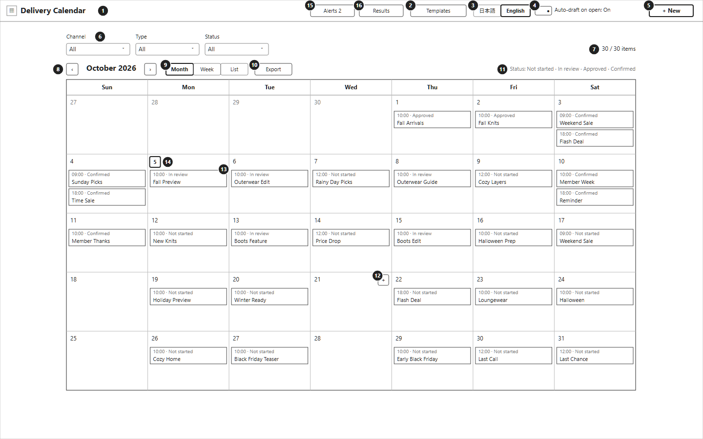

draw.io: `drawio/01-calendar.drawio`

### Elements

| No. | Element | Content and actions |
| --- | --- | --- |
| 1 | Screen name | "Delivery Calendar". The first screen users see |
| 2 | Templates | Opens template management (10) |
| 3 | Display language | Switches the UI language between 日本語 and English |
| 4 | Auto-draft on open | Whether opening an empty delivery starts an AI draft automatically (On / Off) |
| 5 | New | Creates a new delivery (opens a delivery card) |
| 6 | Filters | Filters by channel (Email / Push), delivery type (Promotion / CRM / EC) and status. "All" clears a filter |
| 7 | Count | Number of deliveries shown / total |
| 8 | Month navigation | Moves to the previous or next month |
| 9 | View | Month / Week (08) / List (13) |
| 10 | Export | Exports the deliveries shown to a file |
| 11 | Status legend | The four statuses, in order of progress |
| 12 | "+" on a day | Appears when hovering over a day. Creates a delivery on that day, with the current channel and type filters filled in |
| 13 | Delivery | Time, status and name. Selecting it opens the delivery card |
| 14 | Today | Today's date is outlined |
| 15 | Alerts | Opens Alerts (12). The number shows open alerts |
| 16 | Results | Opens Results (11) |

### States

- Days without deliveries show only the date.
- Several deliveries on one day are stacked in time order.
- Days of the previous and next month are shown in light text.

---

## 02 Delivery card — Theme

### Purpose

Builds one delivery through its steps (Theme → Template → Hero → Sections → Production notes). Users review AI suggestions and their reasons, adopt or edit them, and check how the email looks. Product info on the right gives the facts for choosing products.

The card opens over the calendar. This figure shows the Theme step. Screens 03–06 show the other steps; the parts outside the middle area (including Product info) are the same as here.

### Figure

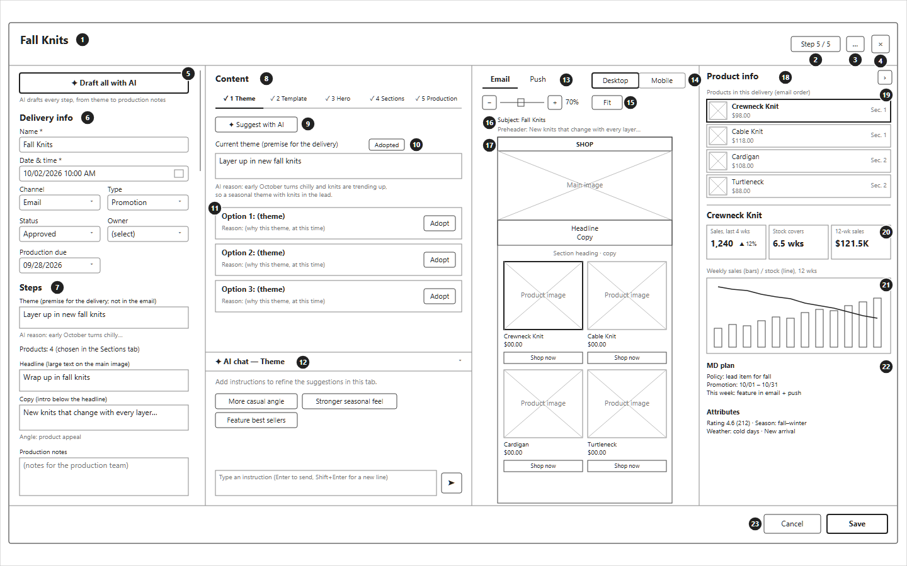

draw.io: `drawio/02-card-theme.drawio`

### Layout

| Area | Content |
| --- | --- |
| Top | Delivery name, step progress, menu, close |
| Left | Delivery info and a summary of each step (scrolls vertically) |
| Middle | Content for each step (switched by tabs), and AI chat |
| Right | Preview (Email / Push) |
| Right edge | Product info (collapsible) |
| Bottom | Cancel and Save |

### Elements

| No. | Element | Content and actions |
| --- | --- | --- |
| 1 | Delivery name | The name of the delivery |
| 2 | Step progress | How many of the five steps are done (for example, Step 5 / 5) |
| 3 | Menu | Duplicate (for another day), delete or cancel, change history |
| 4 | Close | Closes the card (asks for confirmation if there are unsaved changes) |
| 5 | Draft all with AI | AI drafts everything in order: theme → template and main image → headline and copy → each section → production notes. While running, it shows which step is in progress, and which step failed if any |
| 6 | Delivery info | Name and date & time (required), channel, type, status, owner, production due date |
| 7 | Step summary | Theme and its reason, number of products, headline, copy and angle, production notes. Shows everything adopted in one place |
| 8 | Step tabs | 1 Theme, 2 Template, 3 Hero, 4 Sections, 5 Production. Finished steps are checked (✓) |
| 9 | Suggest with AI | AI suggests three themes for this time of year |
| 10 | Current theme | The adopted theme (editable) and the AI's reason |
| 11 | Options | The AI's options, each with a reason. "Adopt" moves it into 10 |
| 12 | AI chat | Adds instructions for the open step ("more casual", "feature best sellers", etc.). Common requests are buttons. Collapsible |
| 13 | Email / Push | Switches the preview between the email and the push notification |
| 14 | Desktop / Mobile | Switches how the email is shown: desktop or smartphone |
| 15 | Zoom | Zooms in and out. "Fit" shows the whole email |
| 16 | Subject and preheader | The email subject and the short text shown in the inbox |
| 17 | Preview | Lays out the main image, headline and copy, sections and products (image, name, price, button) as the template defines. Products can be reordered or removed, and text edited, on the preview |
| 18 | Product info | Panel with the facts for choosing products. "›" collapses it to a narrow bar |
| 19 | Products in this delivery | The delivery's products in email order, with the section each is in. Selecting one shows its details below and outlines it in the preview |
| 20 | Key figures | Sales in the last 4 weeks and the change, weeks of stock cover, 12-week sales |
| 21 | Sales and stock chart | Weekly sales (bars) and stock (line) over 12 weeks |
| 22 | MD plan and attributes | Merchandising policy, promotion period, this week's plan; rating, season, weather fit, new arrival |
| 23 | Cancel / Save | Cancel discards changes and closes. Save saves the content |

### States

- When an empty delivery is opened and "Auto-draft on open" is On, Draft all with AI (5) starts automatically. It can be stopped to open the card without waiting.
- The left area scrolls vertically when the content is long.
- The width of each area can be adjusted by dragging the borders.
- Product info stays open on every step (02–07). When collapsed with "›", it becomes a narrow bar on the right edge, and the preview gets wider.

---

## 03 Delivery card — Template

### Purpose

Chooses the email layout (template) for the delivery. When the template changes, the products are rearranged to fit the new layout.

### Figure

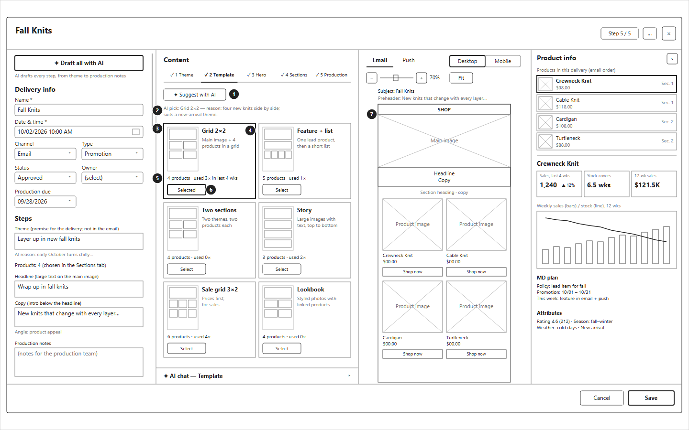

draw.io: `drawio/03-card-template.drawio`

### Elements

Parts outside the middle area are the same as in 02.

| No. | Element | Content and actions |
| --- | --- | --- |
| 1 | Suggest with AI | AI picks the template that suits the theme and time of year |
| 2 | AI pick and reason | Which template AI picked, and why |
| 3 | Layout outline | A small outline of the whole layout (main image, sections, product grid). Hovering shows it larger |
| 4 | Name and description | The template name, and what kind of delivery it suits |
| 5 | Products and recent use | How many products it holds, and how often it was used in the last 4 weeks (to avoid repeating the same look) |
| 6 | Select | Selects the template. The selected one is outlined |
| 7 | Preview | Shows the delivery with the selected template |

---

## 04 Delivery card — Hero

### Purpose

Chooses the main image (hero) at the top of the email.

### Figure

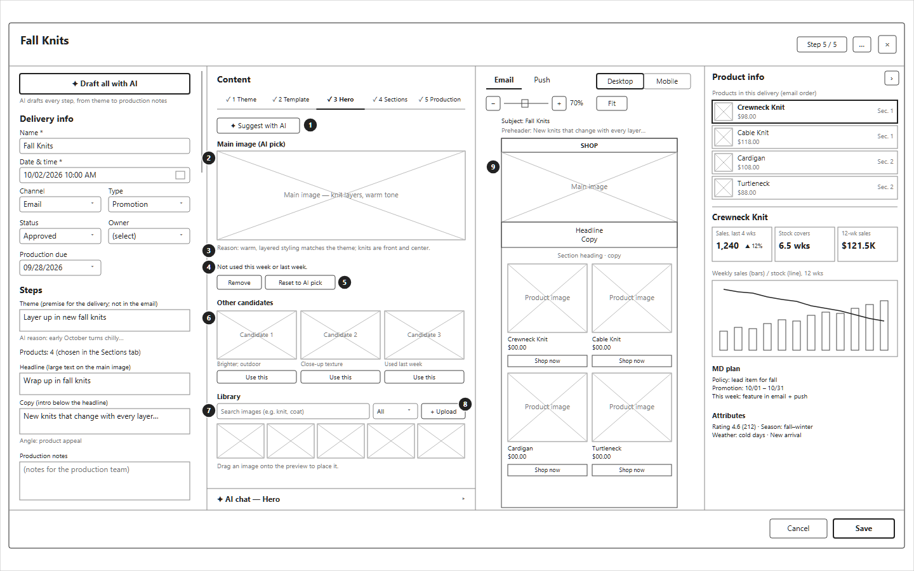

draw.io: `drawio/04-card-hero.drawio`

### Elements

| No. | Element | Content and actions |
| --- | --- | --- |
| 1 | Suggest with AI | AI picks a main image, with runner-up candidates |
| 2 | Main image | The chosen image, shown whole (portrait or landscape, without cropping). Hovering shows it larger |
| 3 | Reason | Why this image was chosen, and how it differs from the candidates |
| 4 | Reuse check | Whether the same image is used in this week or the previous week |
| 5 | Remove / Reset to AI pick | Removes the image, or returns to the AI's pick |
| 6 | Other candidates | Runner-up images, each with a short note. "Use this" swaps it in |
| 7 | Library | Searches all images for the US, filters by category |
| 8 | Upload | Adds a new image to the library |
| 9 | Preview | Shows the main image in the email. An image can also be dragged from the library onto the preview |

---

## 05 Delivery card — Sections

### Purpose

Writes each section's heading and copy, and chooses its products. Shows how often each product is featured this week and last week, so that no product is pushed too often.

### Figure

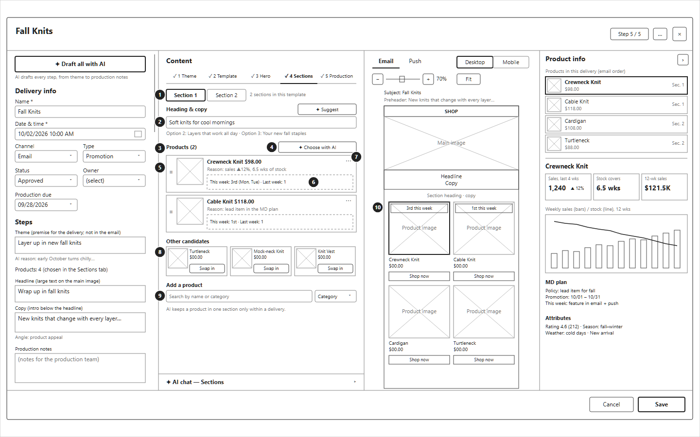

draw.io: `drawio/05-card-sections.drawio`

### Elements

| No. | Element | Content and actions |
| --- | --- | --- |
| 1 | Section selector | Switches between the template's sections |
| 2 | Heading & copy | The section's heading and copy (editable), with other AI options. "Suggest" asks AI for new options |
| 3 | Products | The products in this section |
| 4 | Choose with AI | AI chooses products for the section, each with a reason, plus runner-up candidates |
| 5 | Product row | Image, name, price and the reason it was chosen (the reason is editable). "≡" reorders |
| 6 | Exposure | Which other deliveries this week also feature the product (and which number this is), and how often it was featured last week |
| 7 | Product menu | Swap with a candidate, remove, reset to the AI's choice |
| 8 | Other candidates | Runner-up products. "Swap in" replaces the selected product |
| 9 | Add a product | Searches all products by name or category |
| 10 | Exposure on the preview | Each product in the preview shows how many times it is featured this week |

### States

- Within one delivery, a product appears in only one section.

---

## 06 Delivery card — Production notes

### Purpose

Writes notes for the production team, and hands the delivery over to production.

### Figure

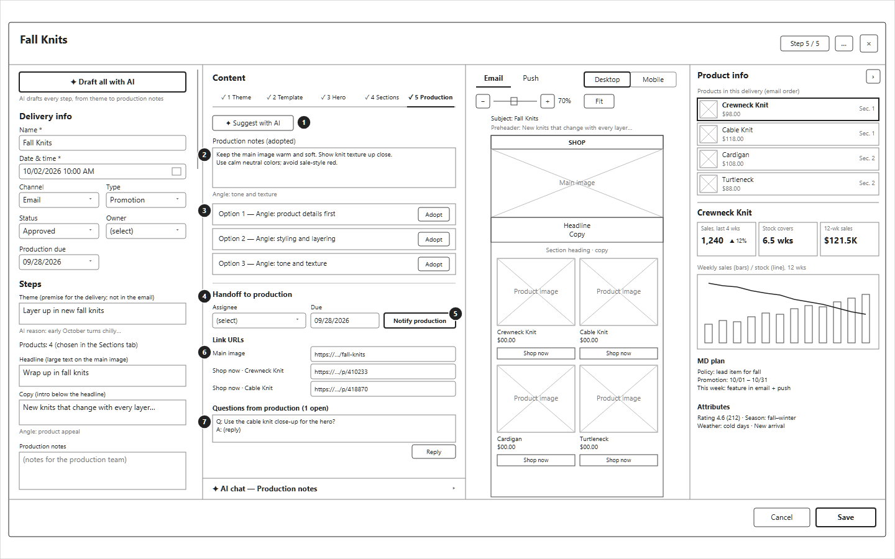

draw.io: `drawio/06-card-production.drawio`

### Elements

| No. | Element | Content and actions |
| --- | --- | --- |
| 1 | Suggest with AI | AI suggests three sets of notes, each from a different angle |
| 2 | Production notes | The adopted notes (editable) and their angle |
| 3 | Options | AI's options. "Adopt" moves one into 2 |
| 4 | Handoff to production | Assignee and due date |
| 5 | Notify production | Tells the assignee that the delivery is ready |
| 6 | Link URLs | The actual link for the main image and each button, set per delivery |
| 7 | Questions from production | Questions from the production team and replies, kept with the delivery |

---

## 07 Delivery card — Push

### Purpose

Builds a push notification. A push is its own delivery card (its own owner, status and time), linked to the email it goes with. The linked email shows whether the two are aligned.

### Figure

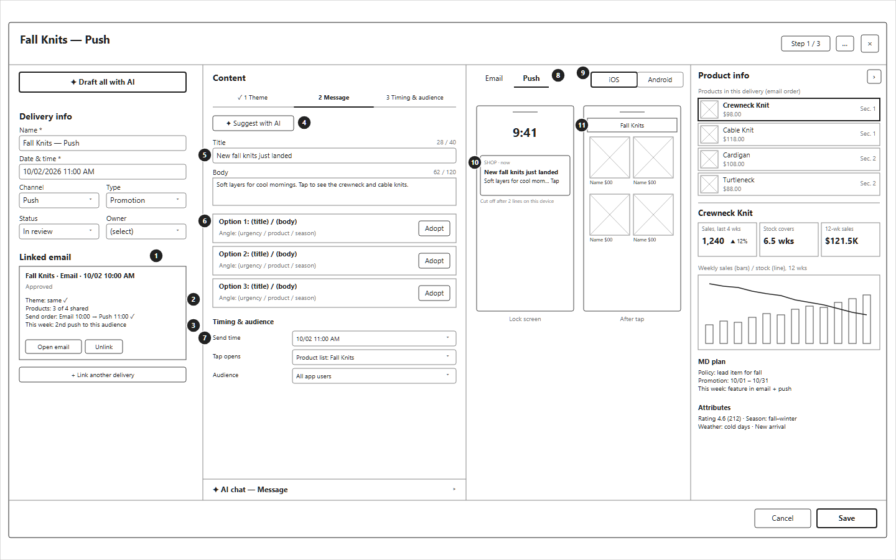

draw.io: `drawio/07-card-push.drawio`

### Elements

| No. | Element | Content and actions |
| --- | --- | --- |
| 1 | Linked email | The email this push goes with: name, date and time, status. "Open email" opens it; "Unlink" removes the link |
| 2 | Alignment | Whether the theme and products match the email, and whether the send order is as intended |
| 3 | Frequency | How many pushes this audience gets this week |
| 4 | Suggest with AI | AI suggests short messages that fit the character limits |
| 5 | Title and body | The push title and body, with character counts |
| 6 | Options | AI's options, each with its angle. "Adopt" moves one into 5 |
| 7 | Timing & audience | Send time (separate from the email), the screen that opens on tap, and the audience (all users or a segment) |
| 8 | Email / Push | The preview shows Push |
| 9 | iOS / Android | Switches the device style |
| 10 | Lock screen | How the notification looks, and where the text is cut off |
| 11 | After tap | The screen that opens when the notification is tapped |

### States

- The steps of a push are: 1 Theme (shared with the linked email), 2 Message, 3 Timing & audience.
- When the theme or products of the linked email change, the push card shows it.

---

## 08 Week view & review

### Purpose

Shows one week of deliveries side by side, so the team can review the week as a whole (product balance, email and push alignment, the MD plan) and confirm it.

### Figure

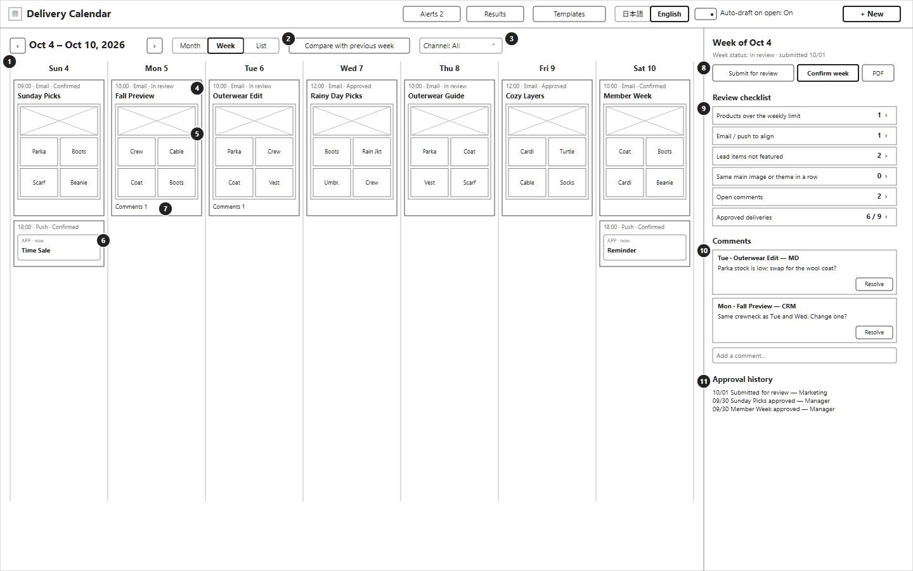

draw.io: `drawio/08-week-review.drawio`

### Elements

| No. | Element | Content and actions |
| --- | --- | --- |
| 1 | Week navigation | Moves to the previous or next week. Month / Week / List switches the view |
| 2 | Compare with previous week | Opens Compare weeks (09) |
| 3 | Channel filter | Shows all, email only or push only |
| 4 | Delivery | Time, channel, status and name. Selecting it opens the delivery card |
| 5 | Small preview | The main image and the product names, to compare deliveries at a glance |
| 6 | Push | A push delivery, shown as a notification |
| 7 | Comments | Number of review comments on the delivery |
| 8 | Week status and actions | The week's status. "Submit for review" notifies the reviewers. "Confirm week" (approver) confirms all deliveries of the week. "PDF" exports the week for review meetings |
| 9 | Review checklist | Points to check for the week, with counts: products over the weekly limit, email and push to align, lead items not featured, repeated main image or theme, open comments, approved deliveries. Selecting one shows the deliveries involved |
| 10 | Comments | Comments from reviewers per delivery or product. "Resolve" marks one as handled |
| 11 | Approval history | Who submitted and approved what, and when |

### States

- After the week is confirmed, changes need a reason and go back to review.

---

## 09 Compare weeks

### Purpose

Shows this week and the previous week as small previews, to see how often each product, main image and theme is featured, and to fix overexposure.

### Figure

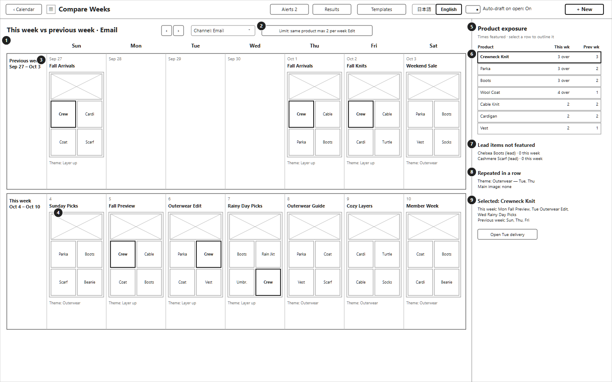

draw.io: `drawio/09-compare-weeks.drawio`

### Elements

| No. | Element | Content and actions |
| --- | --- | --- |
| 1 | Weeks shown | This week and the previous week. "‹ ›" moves both weeks |
| 2 | Weekly limit | The limit on how often the same product is featured in a week. "Edit" changes it |
| 3 | Week rows | The previous week (top) and this week (bottom), by day |
| 4 | Small preview | Main image and products of each delivery. The product selected in 6 is outlined everywhere it appears |
| 5 | Product exposure | Products by number of times featured this week and last week. Products over the limit are marked "over" |
| 6 | Selected product | Selecting a row outlines that product in all previews |
| 7 | Lead items not featured | Products the MD plan marks as lead items that no delivery features this week |
| 8 | Repeated in a row | The same theme or main image on consecutive deliveries |
| 9 | Details | Where the selected product appears. "Open … delivery" opens that delivery card to swap the product |

---

## 10 Template management

### Purpose

Creates and edits email layouts (templates). Push templates are managed on the Push tab.

### Figure

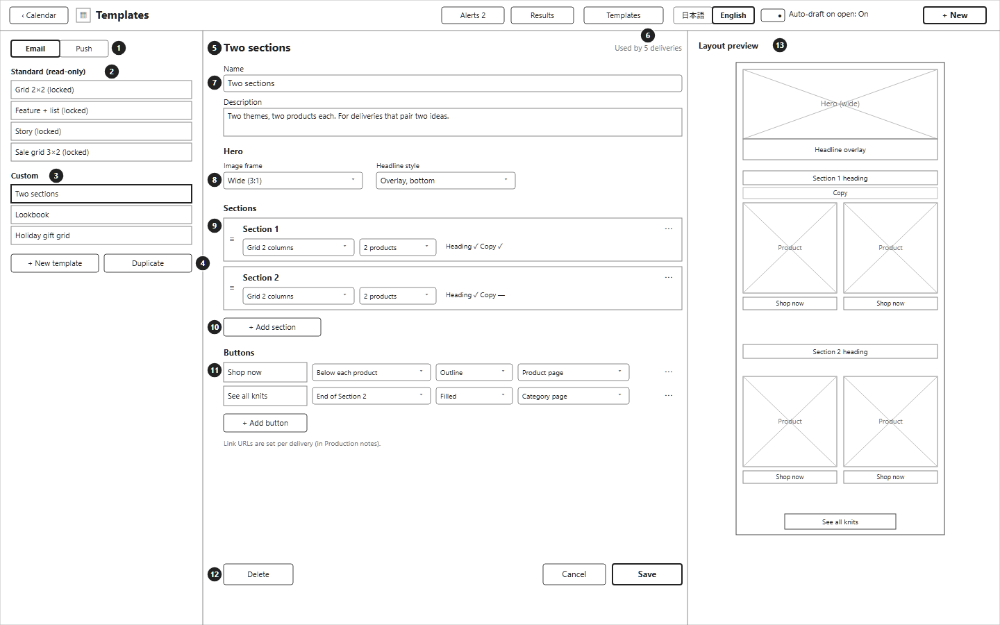

draw.io: `drawio/10-templates.drawio`

### Elements

| No. | Element | Content and actions |
| --- | --- | --- |
| 1 | Email / Push | Switches between email and push templates |
| 2 | Standard templates | Provided templates. They cannot be changed or deleted, but can be duplicated |
| 3 | Custom templates | Templates made by the team. Anyone on the team can edit them |
| 4 | New template / Duplicate | Creates a new template, or copies the selected one |
| 5 | Template name | The template being edited |
| 6 | Used by | How many deliveries use this template (the impact of changes) |
| 7 | Name and description | The name, and what kind of delivery it suits (shown when choosing a template) |
| 8 | Hero | The main image frame (wide, square, etc.) and how the headline is shown |
| 9 | Sections | Each section's layout, number of products, and whether it has a heading and copy. "≡" reorders, "⋯" deletes |
| 10 | Add section | Adds a section |
| 11 | Buttons | Each button's text, position, style and link type. The actual URL is set per delivery |
| 12 | Delete / Cancel / Save | Delete asks for confirmation and shows how many deliveries use the template |
| 13 | Layout preview | The layout outline, updated as the template is edited |

---

## 11 Results

### Purpose

Looks back at results after delivery, to use in planning the next weeks: which themes, layouts and products got a good response.

### Figure

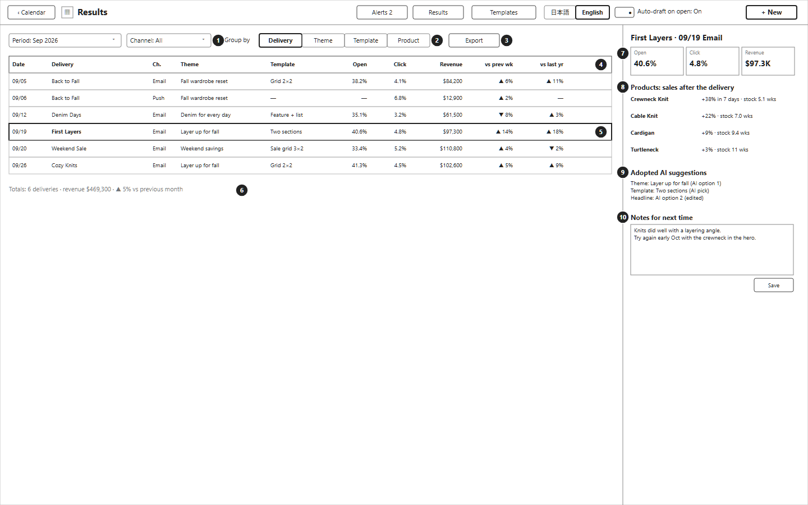

draw.io: `drawio/11-results.drawio`

### Elements

| No. | Element | Content and actions |
| --- | --- | --- |
| 1 | Period and channel | The period and channel to show |
| 2 | Group by | Shows results per delivery, theme, template or product |
| 3 | Export | Exports the table |
| 4 | Results table | Open rate, click rate and revenue for each delivery, compared with the previous week and last year |
| 5 | Selected delivery | Selecting a row shows its details on the right |
| 6 | Totals | Totals for the period |
| 7 | Key figures | Open rate, click rate and revenue of the selected delivery |
| 8 | Product sales | How each product's sales and stock moved after the delivery |
| 9 | Adopted AI suggestions | Which AI suggestions were adopted, to compare them with the results |
| 10 | Notes for next time | Notes from the review, kept with the delivery |

### States

- Results are loaded into each delivery after it is sent.

---

## 12 Alerts

### Purpose

Lists changes that affect upcoming deliveries (out of stock, MD policy changes, low stock, date changes), and fixes the affected deliveries in one place.

### Figure

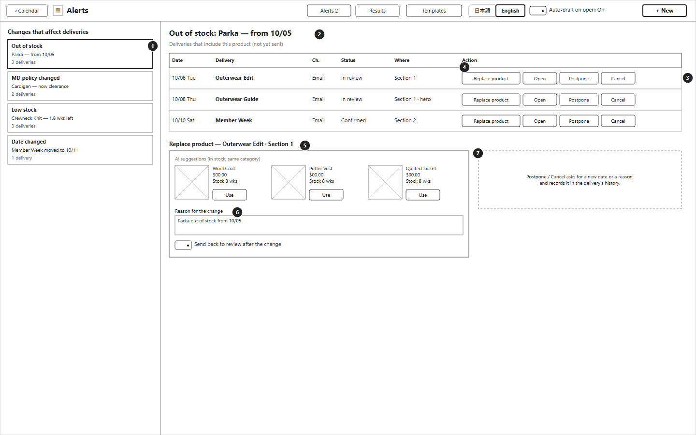

draw.io: `drawio/12-alerts.drawio`

### Elements

| No. | Element | Content and actions |
| --- | --- | --- |
| 1 | Alerts | Each change, the product or delivery it concerns, and how many deliveries it affects |
| 2 | Selected alert | The change being handled |
| 3 | Affected deliveries | Deliveries not yet sent that include the product: date, name, channel, status, and where the product is used |
| 4 | Actions | Replace product, Open (the delivery card), Postpone, Cancel |
| 5 | Replace product | AI suggests in-stock products of the same category. "Use" swaps one in |
| 6 | Reason and review | The reason for the change, kept in the delivery's history. The delivery can be sent back to review |
| 7 | Postpone / Cancel | Asks for a new date or a reason, and records it |

---

## 13 List view

### Purpose

Shows deliveries as a table, for checking many deliveries at once and sharing with stakeholders.

### Figure

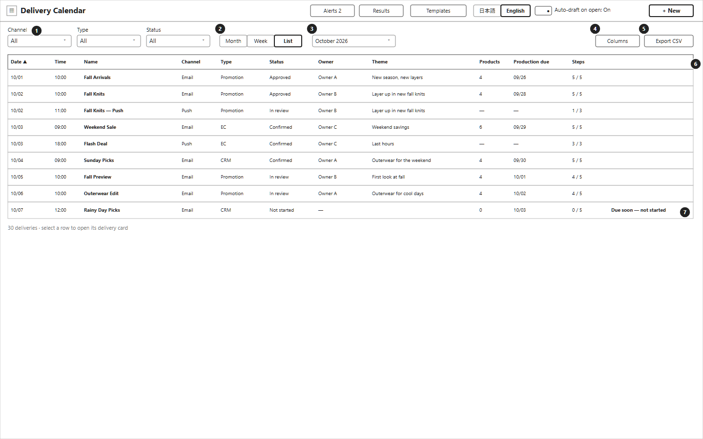

draw.io: `drawio/13-list.drawio`

### Elements

| No. | Element | Content and actions |
| --- | --- | --- |
| 1 | Filters | Channel, type, status (the same as in 01) |
| 2 | View | Month / Week / List |
| 3 | Period | The month shown |
| 4 | Columns | Chooses which columns to show |
| 5 | Export CSV | Exports the table |
| 6 | Table | Date, time, name, channel, type, status, owner, theme, number of products, production due date, steps done. Columns can be sorted. Selecting a row opens the delivery card |
| 7 | Deadline warning | Deliveries coming up soon that are not started yet |
