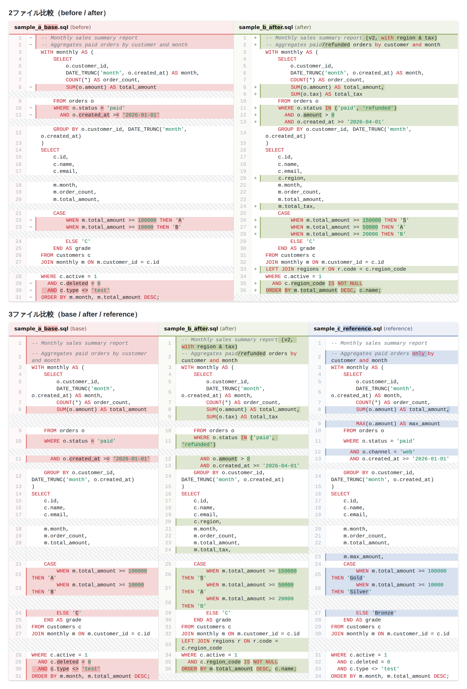

# Diff to HTML（VS Code 拡張機能）

社内エンジニア向けの VS Code 拡張機能です。選択した **2〜3 個のファイルの差分**を、**Confluence の HTML マクロにそのまま貼り付けられる HTML**（インライン CSS のフラグメント）として生成、および HTML ファイルとして保存できます。SQL レビュー資料の作成を素早く・見やすくすることを目的としています。

- 現在のバージョン: **v0.11.1**
- 対応 VS Code: **1.75 以降**

---

## 1. 概要

SQL 修正のレビューでは、修正前後のソース差分を Confluence にまとめます。VS Code の差分ビューは見やすい一方、その見た目のまま Confluence に貼れる HTML を出す手段がありませんでした。本拡張はそこを埋めます。

主な特長:

- **VS Code エクスプローラーで 2〜3 ファイルを選んで右クリック**するだけで差分 HTML を生成。
- 出力は **`<html>`/`<body>` を含まない「部品（フラグメント）」**なので、Confluence の HTML マクロに貼っても崩れません（すべてインライン CSS）。
- **SQL シンタックスハイライト**（予約語・リテラル・コメント）付き。
- **3 ファイル比較**は base / after / reference の 3 ペインを横並び表示。base 側も差分箇所を強調します。
- ペインごとの色・濃さ・フォント・行間を**設定でカスタマイズ**可能（プレビュー上でライブ調整も可）。
- HTML は自動保存されず、**明示的に「HTMLを保存」した時だけ**ファイル化（git を汚しません）。

---

## 2. 出力サンプル

2 ファイル比較（before / after）と 3 ファイル比較（base / after / reference）の出力例です。



> ※ このページに画像として添付してください（ファイル名: `diff-to-html-sample.png`）。

見方:
- **追加＝緑 / 変更前(base)＝赤 / 参考(reference)＝青**。行全体は淡い背景、変更文字はやや濃いハイライトで示します。
- 行番号の左の **`+` / `−`** と左端のカラーバーで、背景色が薄い環境でも差分を判別できます。
- 相手側に対応行がない箇所は**斜線ハッチ**で表します。
- 予約語（`SELECT` など）は赤、文字列・数値は緑、コメントはグレーで色分けします。

---

## 3. インストール方法（VSIX）

> 配布ファイル: `diff-to-html-0.11.1.vsix`（社内 Git のリリースから取得してください）

1. `diff-to-html-0.11.1.vsix` をローカルにダウンロードします。
2. VS Code を開き、左側の **拡張機能ビュー**（四角が 4 つのアイコン、`Ctrl+Shift+X`）を開きます。
3. 拡張機能ビュー右上の **「…」メニュー → 「VSIX からのインストール…」** を選択します。
4. ダウンロードした **`diff-to-html-0.11.1.vsix`** を選びます。
5. 画面の案内に従い、**「再読み込み（Reload）」** して完了です。

補足:
- 旧名の拡張「**Export to Diff HTML**」を入れていた場合は、右クリックメニューが重複しないよう**アンインストールしてから**新しい VSIX を入れてください。
- VSIX が使いにくい環境では、配布フォルダ（`diff-to-html`）を丸ごと `~/.vscode/extensions/` に置くだけでも動作します（`npm install` 不要）。
- 動作要件は VS Code 1.75 以降です。

---

## 4. 利用方法

### 4-1. 出力する（差分 HTML の作成）

1. VS Code の**エクスプローラー**（サイドバーのファイルツリー）で、比較したいファイルを **2 個または 3 個**選択します（`Ctrl` / `⌘` を押しながらクリック）。
2. 右クリック → **「Diff to HTML」** を選びます。
   - 2 個 → 2 ファイル差分（before / after、左右）
   - 3 個 → 3 ファイル差分（base / after / reference、3 ペイン。**基準は左端 = 最初に選んだファイル**）
   - 1 個または 4 個以上のときは「2または3 個のファイルを選択してください」と表示されます。
3. パネルが開き、**左にソース（HTML）／右にプレビュー**が並びます。境目はドラッグで幅を変えられます。
4. 左上の**コピーアイコン**を押すと HTML がクリップボードにコピーされます。
5. Confluence 側で **HTML マクロ**を挿入し、その中に貼り付けてください（※後述の注意を参照）。
6. 必要に応じて、下部バーの **「HTMLを保存」** でファイルとして書き出せます（保存先はダイアログで選択）。

> **Confluence 貼り付けの注意**: 貼り付け先は必ず **HTML マクロ**を使ってください（本文に直接貼ると HTML として解釈されません）。出力はインライン CSS のみで自己完結しているので、追加の CSS 設定は不要です。

### 4-2. 設定する（見た目のカスタマイズ）

プレビュー下部の **「🎨 色を選ぶ」バー**で、その場で見た目を調整できます。変更は**プレビューに即反映**されます。

- **カラーピッカー（base / after / ref）**: 各ペインの基本色を選ぶと、差分行・差分文字・カラーバー・ヘッダが連動して変わります。各色の**コピー**ボタンでコードを取得できます。
- **透過度スライダー（行 / 文字）**: 「差分行の背景の濃さ」と「差分文字の濃さ」を調整します。
- **既定に戻す**: 色・透過度を組み込み既定値に戻します（保存済み設定は消しません）。
- **設定に保存**: 現在の色・透過度を**ユーザー設定に保存**します（次回以降の既定になります）。
- **HTMLを保存**: 表示中の HTML をファイルに書き出します。

設定は VS Code の **設定画面（「Diff to HTML」で検索）** または `settings.json` からも変更できます。

| 設定キー | 既定 | 内容 |
|----------|------|------|
| `diffToHtml.fontFamily` | Roboto Mono … | コードのフォント |
| `diffToHtml.fontSize` | 12 | フォントサイズ(px) |
| `diffToHtml.lineHeight` | 1.35 | 行の高さ(行間) |
| `diffToHtml.colors.baseColor` | `#E17B7B` | base（左・赤）ペインの基本色 |
| `diffToHtml.colors.afterColor` | `#93AE68` | after（緑）ペインの基本色 |
| `diffToHtml.colors.refColor` | `#7E9BC8` | reference（青）ペインの基本色 |
| `diffToHtml.diffLineOpacity` | 0.30 | 差分行の背景の濃さ（0〜1） |
| `diffToHtml.diffCharOpacity` | 0.55 | 差分文字（行内ハイライト）の濃さ（0〜1） |
| `diffToHtml.syntax.keyword` | `#CF222E` | SQL 予約語の色 |
| `diffToHtml.syntax.literal` | `#098658` | SQL リテラル（文字列・数値）の色 |
| `diffToHtml.syntax.comment` | `#6E7781` | SQL コメントの色 |

`settings.json` の例:

```json
{
  "diffToHtml.fontSize": 13,
  "diffToHtml.colors.baseColor": "#D9534F",
  "diffToHtml.diffLineOpacity": 0.24
}
```

各ペインは「基本色 1 色 ＋ 透過度」から、差分行・差分文字・カラーバー・ヘッダ等を自動生成します。基本色を変えれば補助色もまとめて追従します。

---

## 5. 補足・問い合わせ

- 動作確認用のサンプル SQL は配布物の `samples/` に同梱しています（A・B で 2 ファイル、A・B・C で 3 ファイル比較を試せます）。
- 不具合・要望は（配布元の連絡先／チャンネルをここに記載してください）。
