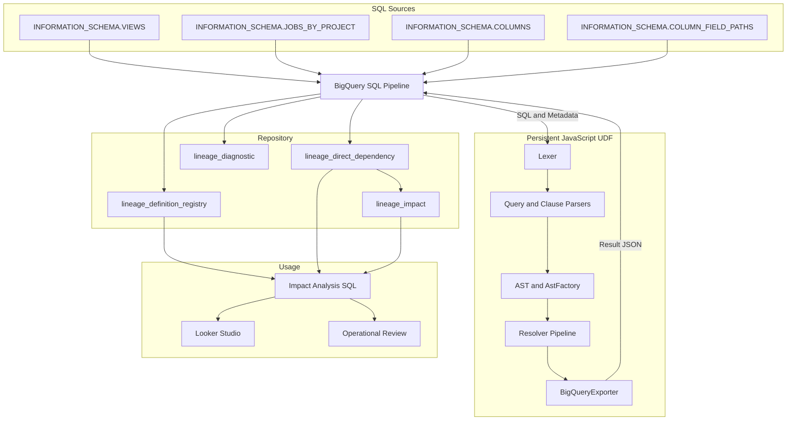
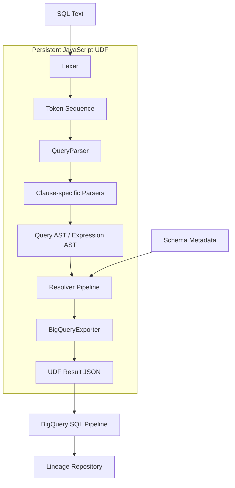
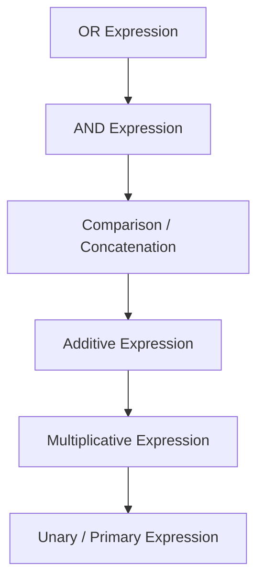
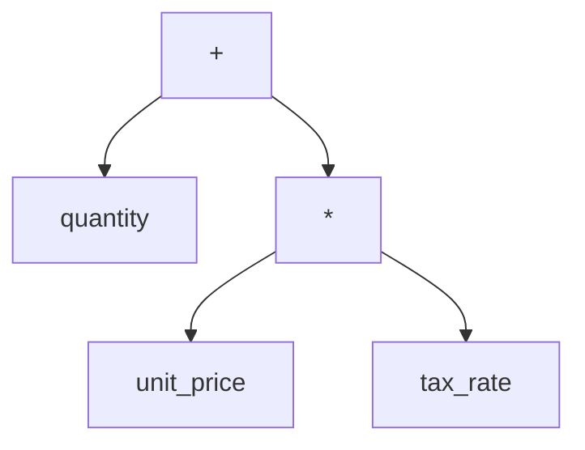
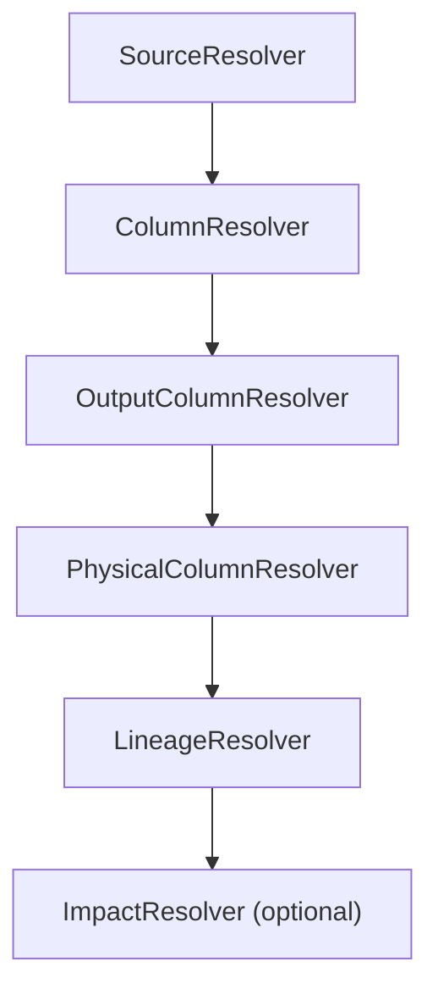

# BigQuery Physical Lineage Architecture Overview

> **Version:** 0.91 Condensed Draft  
> **Source document:** Architecture Overview v0.91 Draft  
> **Implementation baseline:** lineage v1.5.0-028

---

## 目次

1. [システム概要](#1-システム概要)
2. [システム全体構成](#2-システム全体構成)
3. [実装方式の選定](#3-実装方式の選定)
4. [SQL解析アーキテクチャ](#4-sql解析アーキテクチャ)
5. [JavaScript UDFの実行基盤](#5-javascript-udfの実行基盤)
6. [対象範囲](#6-対象範囲)
7. [用語](#7-用語)

---

# 1. システム概要

## 1.1 背景

BigQueryを利用したデータ基盤では、テーブル、View、Scheduled Query、DAGなどを通じて、多数のデータオブジェクトが相互に参照される。

物理テーブルのカラム変更や廃止を行う場合、運用担当者は次の点を確認する必要がある。

- 変更対象のカラムを参照しているViewはどれか
- そのViewのどの出力カラムへ影響するか
- 下流のViewや生成テーブルへ、どこまで影響が伝播するか
- CTEやサブクエリを経由した間接依存が存在しないか
- 削除済みViewや生成されなくなったテーブルがRepositoryへ残っていないか

テーブル単位の依存関係だけでは、これらを十分な精度で判断できない。

本システムは、**カラムレベルのPhysical Lineage Repository**を構築し、影響分析の精度と効率を改善する。

## 1.2 目的

> **BigQuery上の物理テーブルまたはカラム変更時に、影響を受ける下流オブジェクトとカラムを、正確かつ効率的に特定できる状態を作る。**

この目的のために、以下を行う。

- View定義および実行済みSQLを収集する
- SQLを構文解析する
- 出力カラムと入力カラムの対応関係を解決する
- 中間ViewやCTEを経由した依存関係を物理カラムまで展開する
- Repositoryへ依存情報を登録する
- 影響範囲をRankまたは深さとして提示する

## 1.3 解決する運用課題

### 影響調査の精度不足

テーブル単位の依存情報では、対象カラムがどの出力カラムへ影響するかを判断できない。結果として、実際には影響しないオブジェクトまで調査候補へ含まれる。

### 影響調査の作業負荷

SQLを目視で追跡する方法では、SQL数と複雑性が増えるほど調査時間が増大する。CTE、サブクエリ、`SELECT *`、式、別名、ネスト構造がある場合は特に負荷が高い。

### Repositoryの鮮度維持

依存関係は一度構築すれば終わりではない。Viewの追加・変更・削除、Scheduled Queryの変更、DAG実行SQLの変更、生成されなくなったテーブルを継続的に反映する必要がある。

---

# 2. システム全体構成

## 2.1 論理構成



Lexer、Parser、AST、Resolver、BigQueryExporterはPersistent JavaScript UDFの内部に含まれる。Metadata収集、UDF呼び出し、Repository更新、Impactの多段展開はBigQuery SQLパイプラインが担当する。

`BigQueryExporter`は、Resolverの結果をBigQueryへ登録しやすいJSONの行配列へ変換する。JavaScriptはSQL解析と依存解決までを担当し、Repositoryへの登録、既存Dependencyの置換、Rank計算、有効・無効状態の管理はBigQuery SQLパイプラインが担当する。

## 2.2 SQLソース

SQL定義、Job履歴、物理カラムMetadataはBigQueryの`INFORMATION_SCHEMA`から取得する。

| SQLソース | 取得・識別方法 | 解析内容 |
|---|---|---|
| View | `INFORMATION_SCHEMA.VIEWS` | `view_definition`に保持された定義SQL |
| Scheduled Query | JOBSの`labels.data_source_id = 'scheduled_query'` | 実際に実行されたSQL |
| DAG | 設定テーブルに登録したサービスアカウントの`user_email` | DAGから実行されたSQL |
| CTAS・DML | JOBSに記録された実行SQL | 生成先とSELECT部分のカラム依存 |

物理カラムの解決には、`INFORMATION_SCHEMA.COLUMNS`と`INFORMATION_SCHEMA.COLUMN_FIELD_PATHS`を利用する。

Google Cloud公式仕様：

- [`INFORMATION_SCHEMA`の概要](https://cloud.google.com/bigquery/docs/information-schema-intro)
- [`INFORMATION_SCHEMA.VIEWS`](https://cloud.google.com/bigquery/docs/information-schema-views)
- [`INFORMATION_SCHEMA.COLUMNS`](https://cloud.google.com/bigquery/docs/information-schema-columns)
- [`INFORMATION_SCHEMA.COLUMN_FIELD_PATHS`](https://cloud.google.com/bigquery/docs/information-schema-column-field-paths)
- [`INFORMATION_SCHEMA.JOBS`](https://cloud.google.com/bigquery/docs/information-schema-jobs)

## 2.3 影響分析UI

利用者はテーブル、View、カラムを指定し、影響先をRank順に確認する。

- Rank 1：直接依存
- Rank 2：中間オブジェクトを1つ経由
- Rank 3以降：さらに下流の間接依存

Looker StudioはRepositoryの利用手段であり、中心となるのはRepositoryの精度と鮮度である。

影響先のオブジェクト・カラムに加え、次の情報を表示する。

| 項目 | 内容 |
|---|---|
| `impact_type` | 影響経路の分類 |
| `dependency_usage_type` | SELECT、WHERE、JOINなどの利用箇所 |
| `dependency_path_display` | 変更元から影響先までの表示用経路 |
| `impacted_expression` | 影響先のSQL式 |

`dependency_usage_type`は現時点ではClause単位の分類であり、式内部での意味的な役割まで完全に分類するものではない。

---

# 3. 実装方式の選定

## 3.1 評価観点

実装方式は一般的な優劣ではなく、今回の目的であるカラムレベル依存解析への適用性で評価する。

- BigQuery構文への対応
- CTE、サブクエリ、別名を含むカラム依存関係の取得
- `SELECT *`の展開
- 最終物理カラムへの解決
- BigQuery内での運用
- 保守性
- 回帰試験可能性

## 3.2 比較結果

| 方式 | 適用性 | 採用 | 理由 |
|---|---:|:---:|---|
| INFORMATION_SCHEMAのみ | 低い | × | Metadata取得には有効だが、SELECT式内のカラム対応を取得できない |
| 文字列検索 | 低い | × | 別名、Scope、式構造を区別できない |
| 正規表現 | 限定的 | × | 再帰構造、CTE、サブクエリ、括弧Scopeを安定して処理しにくい |
| BigQuery SQLのみ | 限定的 | × | 状態管理、Token走査、再帰解析の保守性が低い |
| 既存SQL Parser | 条件付き | × | BigQuery固有構文、UDF統合、必要な出力形式への適合コストがある |
| 独自JavaScript Parser + Resolver | 高い | ○ | 必要な構文とRepository要件に合わせて段階的に実装・検証できる |

## 3.3 BigQuery SQLだけでの実装が難しい理由

SQL Parserでは、文字単位の走査、現在位置の保持、Token列の前後移動、括弧深度管理、状態分岐、再帰的な式解析、AST生成が必要となる。

BigQuery SQLでもToken表や再帰CTEを用いた処理は構成できるが、Parser内部の逐次状態を表現すると、構文判定とデータ変換が複雑に混在する。特に、読み進めた位置の巻き戻し、演算子優先順位、入れ子Queryの再帰解析は、SQLよりも手続き型言語で表現する方が実装意図を明確にできる。

## 3.4 JavaScript UDFを採用する理由

JavaScriptは、文字列・配列操作、ASTのオブジェクト表現、再帰処理、状態管理、クラス・関数による責務分離に適している。Parser本体はNode.jsでも事前試験できる。

そのため、次の分担を採用する。

```text
BigQuery SQL
  → SQL収集、Metadata生成、Repository更新

JavaScript UDF
  → Lexer、Parser、AST生成、Resolver
```

## 3.5 独自JavaScript Parser + Resolver

既存Parserは一般的に有力だが、本システムではBigQuery固有構文、`QUALIFY`、`UNNEST`、STRUCT、ARRAY、JavaScript UDF上での実行、必要なカラム依存形式へ適合させる必要がある。

独自実装には開発コストがある一方、対象構文を限定し、Repositoryに必要な情報だけを出力できる。未対応構文は回帰試験とともに段階的に追加し、汎用SQL Parser製品を目指さない。

## 3.6 採用構成

```text
INFORMATION_SCHEMA / JOBS
        +
BigQuery SQL Pipeline
        +
Custom JavaScript Parser
        +
Resolver
        +
Lineage Repository
```

この構成により、BigQueryによるMetadata・運用処理と、JavaScriptによる構文解析・参照解決を分離する。

---

# 4. SQL解析アーキテクチャ

## 4.1 処理フロー



図の`Persistent JavaScript UDF`内が、JavaScriptで実行される解析処理である。公開入口である`LineageEngine`が、Lexer、Parser、Resolver、Exporterを定められた順序で呼び出す。SQLの構造と参照関係をJavaScript UDF内で解決した後、BigQuery SQLパイプラインが結果を検証し、Repositoryへ永続化する。

## 4.2 Lexer

LexerはSQL文字列をKeyword、Identifier、Number、String、Operator、Symbol、CommentなどのToken列へ変換する。

例えば、次のSQLをToken化する。

```sql
SELECT quantity * unit_price AS total_amount
FROM raw.orders;
```

主要部分は次のToken列になる。

| token_seq | token | normalized_token | token_type | paren_depth |
|---:|---|---|---|---:|
| 1 | `SELECT` | `SELECT` | `KEYWORD` | 0 |
| 2 | `quantity` | `QUANTITY` | `IDENTIFIER` | 0 |
| 3 | `*` | `*` | `OPERATOR` | 0 |
| 4 | `unit_price` | `UNIT_PRICE` | `IDENTIFIER` | 0 |
| 5 | `AS` | `AS` | `KEYWORD` | 0 |
| 6 | `total_amount` | `TOTAL_AMOUNT` | `IDENTIFIER` | 0 |
| 7 | `FROM` | `FROM` | `KEYWORD` | 0 |
| 8 | `raw` | `RAW` | `IDENTIFIER` | 0 |
| 9 | `.` | `.` | `SYMBOL` | 0 |
| 10 | `orders` | `ORDERS` | `IDENTIFIER` | 0 |
| 11 | `;` | `;` | `SYMBOL` | 0 |

各Tokenには値だけでなく、`token_seq`、行番号、列番号、括弧深度を保持する。`token_seq`はParser、Resolver、診断情報、保存データで共有する論理位置である。括弧深度を持つことで、サブクエリ内部の`SELECT`や`FROM`を外側Queryの句境界と区別できる。

## 4.3 Token Reader

Token Readerは、ParserがToken列を安全に読み進めるための共通インターフェースである。

- 現在位置の参照と次Tokenへの移動
- 解析開始位置の記録と巻き戻し
- コメントを除外した参照
- 対応する閉じ括弧の検索
- Token範囲の切り出し
- Token列パターンの検索

Parserが個別に配列indexを操作すると、コメントの読み飛ばし、括弧対応、巻き戻しが重複する。Token Readerへ共通化することで、各Parserは文法判定へ集中できる。

## 4.4 QueryParser

`QueryParser`はSELECT系Query全体を統合する。

- `WITH`句とCTE定義の検出
- CTE内部Queryの再帰解析
- `UNION`、`INTERSECT`、`EXCEPT`の分岐解析
- Clause ParserとClause別Parserの呼び出し
- SELECT式に対するExpression Parserの呼び出し
- 解析結果のQuery ASTへの統合

```sql
WITH order_total AS (
  SELECT customer_id, SUM(amount) AS total_amount
  FROM raw.orders
  GROUP BY customer_id
)
SELECT customer_id, total_amount
FROM order_total;
```

CTE本文と最終SELECTを別々のQueryとして解析し、親子Scopeを持つQuery ASTを生成する。

Viewでは`INFORMATION_SCHEMA.VIEWS.view_definition`から取得したQueryを解析する。JOBS由来のSQLではBigQuery SQL側が解析対象と生成先を特定し、依存関係を生成するSELECT部分をUDFへ渡す。

## 4.5 Clause Parser

Clause ParserはSELECT QueryをSELECT、FROM、WHERE、GROUP BY、HAVING、QUALIFY、ORDER BY、LIMITへ分解する。

句境界は括弧深度を考慮して判定する。サブクエリ内部の`FROM`などを外側SELECTの境界として扱わず、Clauseの開始・終了位置だけを生成して詳細解析をClause別Parserへ委譲する。

## 4.6 Clause別Parser

| Parser | 主な解析内容 |
|---|---|
| `SelectParser` | SELECT項目、出力別名、`*`、`EXCEPT`、`REPLACE` |
| `FromParser` | FROMソース、JOIN、別名、サブクエリ、UNNEST、PIVOT |
| `WhereParser` | WHERE条件式 |
| `GroupByParser` | GROUP BY項目 |
| `HavingParser` | HAVING条件式 |
| `QualifyParser` | QUALIFY条件式 |
| `OrderByParser` | ORDER BY項目、ASC・DESC、NULLS指定 |
| `LimitParser` | LIMIT、OFFSET |

SELECT項目とFROMソースでは必要となる構造が異なる。Clauseごとに入力範囲と出力形式を限定することで、単一の巨大なParserを避け、構文追加時の影響範囲を抑える。

## 4.7 Expression ParserとAstFactory

SELECT項目やWHERE条件には、演算、関数呼び出し、CASE式、Window関数などが入れ子になって記述される。

Expression Parserは、Token列を左から読みながら、各Tokenの役割、演算子の優先順位、式の入れ子を判定し、AstFactoryを通じてASTを生成する。

主な処理は次のとおりである。

1. 指定されたToken範囲を式の解析対象として切り出す
2. 現在位置のTokenが識別子、リテラル、関数、括弧、単項演算などのどれかを判定する
3. 演算子の優先順位に従って左辺と右辺を解析する
4. AstFactoryへ解析結果を渡してAST Nodeを生成する
5. 未消費Tokenが残っていないことを確認する

### 再帰下降Parser

「下降」とは、式全体を扱う規則から、より細かな規則へ順番に処理を委譲することを指す。



下にある演算ほど優先順位が高い。例えば、次の式では加算の右辺を解析するときに乗算の解析へ先に処理を委譲する。

```sql
quantity + unit_price * tax_rate
```



「再帰」とは、括弧内の式、関数引数、CASE式など、式の中に別の式が現れた場合に同じ解析規則を内側へ適用することを指す。スカラサブクエリやEXISTSでは、内側のSELECT Tokenを切り出して`QueryParser`を再帰的に呼び出す。

### AstFactory

Expression Parserは文法を読み取るが、AST Nodeを直接組み立てない。`NodeType`の定義、Node生成、入力値検証はAstFactoryへ集約する。

```javascript
const multiplyNode = AstFactory.createBinary(
  NodeType.ARITHMETIC_EXPRESSION,
  "*",
  unitPriceNode,
  taxRateNode
);

const addNode = AstFactory.createBinary(
  NodeType.ARITHMETIC_EXPRESSION,
  "+",
  quantityNode,
  multiplyNode
);
```

Parserは文法の読み取り、AstFactoryは一貫したAST形式の生成と検証に集中する。AST形式を変更する場合も、Node生成処理を限定された場所で修正できる。

## 4.8 Resolver Pipeline

Parserが生成するASTには、`o.amount`の`o`がどのテーブルを指すか、`amount`がどの物理カラムかまでは確定していない。Resolver PipelineはASTとBigQuery Metadataを組み合わせ、参照先を段階的に具体化する。



| Resolver | 主な責務 |
|---|---|
| `SourceResolver` | QueryごとのScopeを作成し、物理テーブル、CTE、サブクエリ、UNNESTと別名を管理する |
| `ColumnResolver` | 各Clause内のカラム参照を抽出し、参照可能なSourceへ接続する |
| `OutputColumnResolver` | SELECT項目から公開される出力カラム名と式を確定する |
| `PhysicalColumnResolver` | `COLUMNS`と`COLUMN_FIELD_PATHS`から物理カラム、field path、`SELECT *`を解決する |
| `LineageResolver` | CTEやサブクエリを辿り、出力カラムから最終物理カラムまでの経路を作る |
| `ImpactResolver` | 指定された物理カラムを起点とする影響経路を抽出する |

```sql
SELECT o.amount
FROM raw.orders AS o;
```

```text
o.amount
  → alias o
  → source raw.orders
  → physical column raw.orders.amount
  → output column amount
```

CTEやサブクエリの場合は子Scopeへ移動し、対応する出力カラムから依存先を再帰的に辿る。`SELECT *`ではMetadataの`ordinal_position`に従って公開列を展開し、`EXCEPT`と`REPLACE`を反映する。

### ParserとResolverを分離する理由

ParserはSQLの構造をASTへ変換し、ResolverはAST上の参照を物理カラムへ解決する。この責務分離により、構文解析とMetadata依存の参照解決を個別に試験・拡張できる。

また、MetadataがなくてもParserは`o.amount`をIdentifier Expressionとして解析できる。一方、`o`が指すSourceと`amount`の存在確認はResolverが担当するため、構文エラーと参照解決エラーを区別できる。

---

# 5. JavaScript UDFの実行基盤

## 5.1 GCS外部ライブラリ方式

ParserとResolverの実装が進むと、JavaScriptコードはBigQueryのインラインコードサイズ上限を超える。このため、`lineage_udf_bundle.js`をGCSへ配置し、外部ライブラリとして参照する。

BigQueryのJavaScript UDFでは、インラインコードは最大32 KB、外部コードリソースは1ファイル当たり最大1 MBである。最新の制限値はGoogle Cloud公式の[Quotas and limits](https://cloud.google.com/bigquery/quotas)にあるUser-defined functionsの項を参照する。

```sql
CREATE OR REPLACE FUNCTION
  `project.dataset.analyze_lineage_json`(
    sql_text STRING,
    physical_columns_json STRING,
    options_json STRING,
    export_metadata_json STRING
  )
RETURNS STRING
LANGUAGE js
OPTIONS (
  library = [
    'gs://<bucket-name>/lineage/lineage_udf_bundle.js'
  ]
)
AS r"""
  return analyzeLineageForBigQuery(
    sql_text,
    physical_columns_json,
    options_json,
    export_metadata_json
  );
""";
```

GCS方式の主理由はインラインコードサイズ制限への対応である。外部公開用資料ではProject ID、Dataset ID、GCS Bucket名、サービスアカウントなどの環境固有値を掲載しない。

## 5.2 bundleサイズ

lineage v1.5.0-028のbundle実測値は次のとおりである。

```text
File: javascript/dist/lineage_udf_bundle.js
Size: 367,353 bytes
Size: approximately 358.7 KiB
Ratio to 32 KiB: approximately 11.2 times
```

## 5.3 コストと性能

外部ライブラリのファイルサイズ自体が、BigQueryの処理データ量へ直接加算されるわけではない。

### UDF方式別の料金体系

JavaScript UDFに固有の追加実行料金は、Google Cloudの公式料金体系には示されていない。UDFを呼び出すSQLも通常のBigQuery Queryとして扱われ、On-demand pricingでは課金対象データ量、Capacity pricingではSlot容量が料金基準となる。

| UDF方式 | 料金の考え方 |
|---|---|
| SQL UDF | 通常のBigQuery Query料金 |
| JavaScript UDF | 通常のBigQuery Query料金。固有の追加実行料金は公式料金体系に示されていない |
| Python UDF | 通常のQuery料金に加え、ビルド時間とCompute・Memory使用量に基づくBigQuery Services SKUの料金が発生する |
| Remote Function | 通常のQuery料金に加え、呼び出し先のCloud Run functionsまたはCloud Runなどの料金が発生する |

Google Cloud公式ページ：

- [BigQuery pricing](https://cloud.google.com/bigquery/pricing)
- [User-defined functions](https://cloud.google.com/bigquery/docs/user-defined-functions)
- [Work with user-defined functions in Python](https://cloud.google.com/bigquery/docs/user-defined-functions-python)
- [Work with remote functions](https://cloud.google.com/bigquery/docs/remote-functions)

Python UDFの総額はQueryの`total_bytes_billed`だけでは算出できない。Cloud Billingで`MANAGED_ROUTINE_BUILD`と`MANAGED_ROUTINE_EXECUTION`のBilling labelを確認する必要がある。

### 単体View解析の実測結果

約500行の検証用`v_customer_sales_cost_sample`を対象に、`sql/maintenance/07_run_single_view_analysis.sql`を実行した。対象Viewの定義と物理カラムMetadataを取得し、永続JavaScript UDFを1回呼び出す。Repositoryの永続テーブルは更新しない。

| 項目 | 実測値 |
|---|---:|
| View定義サイズ | 11,878 bytes |
| 物理カラムMetadata | 403件 |
| 解析ステータス | `COMPLETED` |
| 診断 | 0件 |
| 出力Lineage | 141件 |
| Lineage Path | 94件 |
| Script実行時間 | 14,147 ms（約14.15秒） |
| 処理データ量 | 31,521,445 bytes（約30.06 MiB） |
| 課金対象データ量 | 52,428,800 bytes（50 MiB） |
| Slot使用量 | 3,052 slot-ms |
| On-demand理論料金 | 約0.000298 USD |

50 MiBを1 TiB当たり6.25 USDとして計算した理論料金は約0.000298 USDである。月間1 TiBまでの無料利用枠が残っている場合、実際の請求額は0 USDとなる。Capacity pricingでは課金対象データ量ではなく契約したSlot容量に基づいて料金が決まる。

実行時間と課金値はUDF内部のParserだけではなく、View定義取得、Metadata生成、一時テーブル作成、UDF呼び出し、結果返却を含む単体解析Script全体の値である。

---

# 6. 対象範囲

## 6.1 解析対象

| 対象 | 解析ソース | 理由 |
|---|---|---|
| View | `INFORMATION_SCHEMA.VIEWS` | 出力カラムと参照元カラムの関係が定義SQLに保持される |
| SELECT | View定義・JOBS | カラム依存関係の基本単位 |
| CTE | View定義・JOBS | 中間結果と最終出力の解決に必要 |
| サブクエリ | View定義・JOBS | 出力式や条件式の依存解決に必要 |
| Scheduled Query | JOBS | 実行SQLから生成テーブルとの依存を取得できる |
| DAG実行SQL | JOBS | 実行済みSQLから依存を取得できる |
| CTAS | JOBS | 生成テーブルと入力カラムの関係を保持できる |
| INSERT ... SELECT | JOBS | 挿入先と入力カラムの関係を保持できる |
| MERGE | JOBS | 更新・挿入対象と入力カラムの関係を扱う。完全対応は次期実装対象 |
| `SELECT *` | SQL + Metadata | 物理スキーマを用いた展開が必要 |
| STRUCT / ARRAY / UNNEST | SQL + Metadata | BigQueryのネスト構造を扱うため |

## 6.2 実行SQLを利用する利点

- 実際に物理オブジェクトへ反映されたSQLだけを対象にできる
- 動的SQLの最終形を取得できる
- 実行されなかった分岐をRepositoryへ登録しない
- DAGやアプリケーションのSQL生成方式へ依存しにくい
- Stored Procedure内部の実行SQLも同じパイプラインへ統合できる

`DECLARE`、`IF`、`EXECUTE IMMEDIATE`などの制御構造を詳細解析しなくても、最終的に実行されたCTAS・DMLをJOBSから取得できれば、実際に形成されたカラム依存関係を構築できる。

## 6.3 Scopeの要約

> 本システムは、BigQuery上で実際に実行されたSQL、およびView定義として保持されるSQLを解析対象とする。Repositoryの目的はカラムレベル依存関係の構築であり、制御構文やSQL生成処理そのものではなく、最終的に実行されるSQLから依存関係を取得することを設計上の前提とする。

---

# 7. 用語

| 用語 | 説明 |
|---|---|
| Physical Lineage | 物理テーブル・View・カラム間の実体ベースの依存関係 |
| Repository | 依存関係、オブジェクト状態、解析状態を保持するBigQueryテーブル群 |
| Lexer | SQL文字列をToken列へ変換する処理 |
| Token | Keyword、Identifier、Symbolなどへ分割されたSQLの解析単位 |
| Token Reader | ParserによるToken列の参照、移動、巻き戻し、範囲抽出を共通化する処理 |
| Parser | Token列をSQL構造として解釈する処理 |
| AST | SQL式やStatement構造を表す抽象構文木 |
| AstFactory | AST Nodeの定義、生成、入力値検証を担当するFactory |
| Resolver | AST上の参照をCTE、別名、Metadataから具体的な参照元へ解決する処理 |
| Scope | Queryごとに分離されたSource・CTE・別名の参照可能範囲 |
| BigQueryExporter | Resolverの解析結果をBigQuery登録用のJSON行配列へ変換する処理 |
| Direct Dependency | SQL内で直接参照されるカラム間の依存関係 |
| Expanded Dependency | 中間Viewを再帰展開した最終物理カラムとの依存関係 |
| Rank | 変更元から影響先までの依存段数 |
| CTAS | `CREATE TABLE AS SELECT` |
| GCS Library | BigQuery JavaScript UDFから参照するCloud Storage上の外部JavaScriptファイル |
