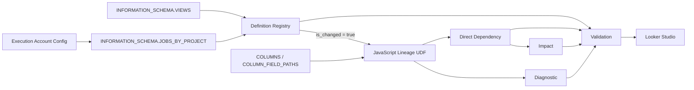

# BigQuery Physical Lineage Repository

BigQuery上のView、Scheduled Query、DAG生成テーブルを対象に、SQL定義を解析して物理テーブルのカラムから下流オブジェクトのカラムまでの依存関係を管理するリポジトリです。

## 解決する課題

BigQueryのメタデータだけでは、複数段のView、CTE、JOIN、集約、`SELECT *`、STRUCT、`ARRAY<STRUCT>`を通過した物理カラムの影響範囲を、列単位で一貫して把握することが困難です。

本リポジトリは、定義変更の検知、JavaScript UDFによる解析、直接依存関係の永続化、Impactの多段展開、診断情報の保存を一つの運用フローとして提供します。

## 主な特徴

- View定義のハッシュによる変更検知
- Scheduled QueryとDAG生成テーブルの登録
- 複数サービスアカウントを`ARRAY<STRING>`で管理
- 物理カラムおよびネストしたfield pathの解決
- Direct Dependencyと多段Impactの分離
- 解析失敗時に旧Dependencyを保護
- 再実行可能なBigQueryスクリプト
- 検証SQLと総合試験SQLを同梱

## アーキテクチャ



## クイックスタート

実行順:

1. `sql/setup/01_setup_lineage_environment.sql`
2. `sql/sample/02_setup_sample_environment.sql`
3. `sql/pipeline/03_run_daily_lineage_pipeline.sql`
4. `sql/validation/04_validate_lineage_environment.sql`
5. `tests/integration/05_repository_integration_test.sql`

セットアップ前に、GCSへJavaScript UDFライブラリを配置し、`01_setup_lineage_environment.sql`のBootstrap値を環境に合わせて変更してください。

特定のサンプルViewだけを解析し、Repositoryを更新せずに結果と実行コストを確認する場合は、`sql/maintenance/07_run_single_view_analysis.sql`を実行します。

## ディレクトリ

```text
docs/                 要件、設計、運用、ADR
javascript/           UDFソース、bundle、Golden・性能回帰試験
looker/               Looker Studio設計資産
sql/setup/            Repository初期構築
sql/sample/           サンプル環境
sql/pipeline/         日次処理
sql/validation/       環境検証
sql/maintenance/      変更オブジェクト解析、単体View解析・保守SQL
sql/bigquery/          永続UDFの再配備・疎通確認用SQL
tests/integration/    総合試験
```

## 主要テーブル

- `lineage_config`
- `lineage_execution_account_config`
- `lineage_definition_registry`
- `lineage_direct_dependency`
- `lineage_impact`
- `lineage_diagnostic`
- `lineage_job_registry`

テーブルごとの役割と全カラムの意味は[Repository Table Reference](docs/REPOSITORY_TABLE_REFERENCE.md)を参照してください。全体設計は[System Design](docs/SYSTEM_DESIGN.md)を参照してください。

`lineage_udf_bundle.js`の生成、検証、リリース、任意のデプロイ手順は[UDF Bundle Build Process](docs/UDF_BUNDLE_BUILD_PROCESS.md)を参照してください。

## 日次運用

通常の日次処理は次のSQLのみです。

```text
sql/pipeline/03_run_daily_lineage_pipeline.sql
```

実行後は`lineage_diagnostic`と`lineage_definition_registry.analysis_status`を確認します。

## 単体View解析とコスト計測

`sql/maintenance/07_run_single_view_analysis.sql`は、次の処理だけを行います。

1. 対象Viewの定義を`INFORMATION_SCHEMA.VIEWS`から取得
2. 日次処理と同じ形式で物理カラムMetadataを生成
3. 永続JavaScript UDFを1回呼び出し
4. 解析結果と`@@script.*`のコスト・性能指標を返却

コスト計測用の約500行のサンプルViewは、次の順で準備・解析します。

1. `sql/sample/02_setup_sample_environment.sql`
2. `sql/sample/02a_create_cost_measurement_view.sql`
3. `sql/maintenance/07_run_single_view_analysis.sql`

`07_run_single_view_analysis.sql`の既定値は`project_id.dataset.v_customer_sales_cost_sample`です。別のViewを解析する場合は、ファイル先頭の`target_view_name`を変更してください。単体解析SQLはRepositoryおよび対象Datasetの永続テーブルを更新しません。

返却される主な計測値は次のとおりです。

- `script_job_id`
- `script_bytes_processed_so_far`
- `script_bytes_billed_so_far`
- `script_slot_ms_so_far`
- `completed_child_job_count`

Job完了後の確定値は、返却された`script_job_id`を使って次のように確認できます。

```sql
SELECT
  job_id,
  total_bytes_processed,
  total_bytes_billed,
  total_slot_ms,
  TIMESTAMP_DIFF(end_time, start_time, MILLISECOND) AS elapsed_ms
FROM
  `project_id.region-asia-northeast1`.INFORMATION_SCHEMA.JOBS_BY_PROJECT
WHERE job_id = 'SCRIPT_JOB_ID';
```

## 現在の状態

SQL、検証、総合試験、24個のJavaScriptソース、確定bundle、48件のGolden regression、性能回帰契約、LTSドキュメントを収録しています。実環境の実行結果、Looker Studio画面、ライセンスは導入環境で確定後に追加します。

## ライセンス

未選定です。公開前に、社内利用限定、Apache License 2.0、MIT Licenseなどから選定してください。

## Current package layout

- `javascript/src`: JavaScript parser and resolver source
- `javascript/dist`: generated BigQuery UDF bundle
- `javascript/test`: regression tests
- `sql/bigquery`: persistent UDF redeployment and contract smoke-test helpers
- `sql/maintenance/07_run_single_view_analysis.sql`: read-only single-View analysis and cost measurement
- `sql/pipeline/03_run_daily_lineage_pipeline.sql`: formal daily pipeline with final non-COMPLETED UDF result output
