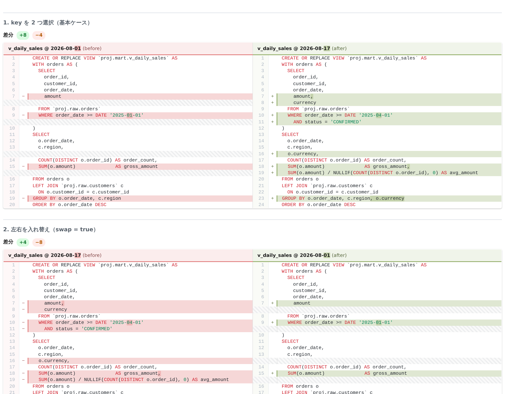

# DDL Diff — Looker Studio コミュニティ ビジュアライゼーション

BigQuery に **`key` と `ddl` の 2 列**でデータを持ち、Looker Studio のフィルタで
**key を 2 つ選ぶと、その 2 件の DDL を GitHub compare 風に左右比較する**
コミュニティ ビジュアライゼーション。



## 設計

```
BigQuery                Looker Studio
─────────────────       ──────────────────────────────────────────────
key   ddl               プルダウン（フィルタ操作）で key を 2 つ選択
────  ────────                    ↓
k1    CREATE VIEW…      viz に (key, ddl) が 2 行だけ渡る
k2    CREATE VIEW…                ↓
k3    CREATE VIEW…      lib/diff.js   … LCS で行差分 + 行内の単語差分
k4    CREATE VIEW…      lib/render.js … インライン CSS の HTML を生成
                                  ↓
                        root.innerHTML = html
```

**DDL をそのまま渡し、HTML はビジュアライゼーション側で作る。** 事前生成した HTML を
DB に持たせない理由は 2 つ:

- インライン CSS の HTML は元の DDL の **約 21 倍**に膨らむ（実測: 200 行の DDL → 201KB）。
  一方レンダリングは **20〜80ms** しかかからないので、事前生成は「20ms の CPU を節約するために
  1 セル数百 KB を運ぶ」取引になる
- 事前生成すると比較の組み合わせが固定される。DDL を渡す方式なら **任意の 2 key を
  レポート上で選んで比較**できる（key が N 件あっても事前生成は不要）

差分ロジックは `diff_html/` の VS Code 拡張（`lib/diff.js` / `lib/render.js`）をそのまま
ベンダリングしている。外部依存ゼロ・`vscode` 非依存なのでブラウザにそのまま載る。
出力が**全部インライン CSS の自己完結フラグメント**である点は、外部ネットワークにアクセス
できないコミュニティ ビジュアライゼーションの sandbox と相性がいい（外部 CSS を読み込む
diff2html だと CSS の同梱が別途必要になる）。

## BigQuery 側のデータ

必要なのは 2 列だけ。

| 列 | 内容 |
|---|---|
| `key` | 比較対象を一意に識別する文字列。プルダウンにそのまま並ぶので、人が読んで選べる形にする |
| `ddl` | その key の DDL 全文 |

`key` の設計次第で比較の軸が決まる（**テーブル構造は変えずに使い分けられる**）:

| やりたいこと | key の例 |
|---|---|
| 同じ View の 2 時点を比較 | `mart.v_daily_sales @ 2026-08-01` |
| 本番と開発の同じ View を比較 | `prod.mart.v_daily_sales` / `dev.mart.v_daily_sales` |
| 似た View 同士を比較 | `mart.v_daily_sales` / `mart.v_daily_sales_v2` |

スナップショットを日次で貯めて「同じ View の 2 時点」を比較する場合の例:

```sql
CREATE OR REPLACE VIEW `PROJECT.DATASET.v_ddl_by_key` AS
SELECT
  FORMAT('%s.%s @ %s', table_schema, table_name, CAST(snapshot_date AS STRING)) AS key,
  ddl
FROM `PROJECT.DATASET.view_ddl_snapshot`;
```

スナップショット表の作り方は [`../ddl_diff.sql`](../ddl_diff.sql) の冒頭を参照。

> `key` は一意にすること。同じ `key` に複数行あると先頭の 1 件だけが使われる。

## Looker Studio での設定

1. レポート編集画面 → **[追加] → [コミュニティ ビジュアリゼーションとコンポーネント]**
   → **[+ 独自の作成物を追加]** に `gs://my-bucket/viz/ddl-diff` を貼り付ける
2. フィールドを割り当てる

   | 設定項目 | 割り当てるフィールド |
   |---|---|
   | key | `key` |
   | DDL | `ddl` |

3. **key を 2 つ選ぶための操作を置く**
   - **[追加] → [コントロール] → [プルダウン リスト]** を配置
   - 「コントロール フィールド」に `key` を指定
   - データタブの **「単一選択にする」をオフ**（＝複数選択可）にする
   - レポート上でそのプルダウンから **key を 2 つ選択**する
4. 必要なら、ビジュアライゼーションの**スタイル**タブで左右を調整する（下表）

### スタイル設定

| 項目 | 既定 | 内容 |
|---|---|---|
| 変更前の key / 変更後の key | 空欄 | 空欄なら渡ってきた 1 件目 / 2 件目。key を完全一致で書くと左右を固定できる |
| 左右を入れ替える | オフ | 1 件目・2 件目の並びが意図と逆のときに使う |
| フォント / フォントサイズ / 行の高さ | Roboto Mono / 12px / 1.35 | |
| 変更前・変更後ペインの基本色 | `#E17B7B` / `#93AE68` | 差分行・差分文字・カラーバー・ヘッダが連動する |
| 差分行の背景の濃さ / 差分文字の濃さ | 0.30 / 0.55 | |
| SQL シンタックス（予約語 / リテラル / コメント） | `#CF222E` / `#098658` / `#6E7781` | |

ペインの見出しには `key` がそのまま出る。2 つの key の**差異部分だけがハイライト**されるので、
`… @ 2026-08-01` と `… @ 2026-08-17` なら日付部分が光る。

### 状態ごとの表示

| 状況 | 挙動 |
|---|---|
| key が 2 件 | 比較して表示 |
| key が 1 件以下 | 「2 つ選択してください」と案内 |
| key が 3 件以上 | 先頭 2 件を比較し、どれを使ったか警告表示 |
| 「変更前/後の key」に存在しない値 | 警告を出して自動選択にフォールバック |
| 2 件の DDL が同一 | 「変更なし」バッジ |

## ディレクトリ

```
src/
  index.js       dscc とのつなぎ込みだけ（購読 → innerHTML）
  viz.js         key ペアの決定と HTML 生成。DOM にも dscc にも依存しない純関数
  lib/diff.js    ベンダリング（差分ロジック）
  lib/render.js  ベンダリング（HTML レンダリング）
  index.json     データ / スタイル設定の定義（Looker Studio のプロパティパネル）
  index.css      iframe 側のスクロール領域だけ
  icon.png       コンポーネント選択画面のアイコン
  manifest.json  デプロイ時に GCS パスを埋め込むテンプレート
scripts/
  preview.mjs    ローカルプレビュー兼スモークテスト（viz.js を直接叩く）
  e2e.mjs        dscc 結線の通しテスト（実ブラウザ + RENDER の postMessage）
  release.mjs    GCS に手で置く一式を release/ に組み立てる
release/         ↑の生成物（コミット済み。手動配置用。直接編集しない）
samples/         動作確認用の SQL
deploy.sh        ビルド + GCS へアップロード
```

`viz.js` を DOM 非依存にしてあるので、**ローカルプレビューと Looker Studio 上が同じコードパス**を通る。

## 開発

```bash
npm install
npm test        # viz.js のスモークテスト（10 シナリオ / 23 アサーション）
npm run e2e     # dscc 結線の通しテスト。実ブラウザに RENDER を postMessage して検証
                # （playwright 未インストールならスキップされる）
npm run preview # dist/preview.html を生成 → ブラウザで開いて全シナリオを確認
npm run build   # dist/index.js（bundle, 約 26KB）+ index.json + index.css + icon.png
npm run release # ↑を release/ に組み立てる（手動配置用。コミットする）
```

## デプロイ

### GCS に置くのは 5 ファイルだけ

`src/lib/` や `src/viz.js`、`@google/dscc` は **esbuild が `index.js` に全部インライン化する**ので、
GCS にコピーする必要はない。

```
gs://my-bucket/viz/ddl-diff/
  manifest.json   Looker Studio が最初に読む。GCS パスを埋めてから置く
  index.js        バンドル済み本体（lib/ + viz.js + dscc を内包、約 26KB）
  index.json      データ / スタイル設定の定義
  index.css       iframe 側のスクロール領域
  icon.png        コンポーネント選択画面のアイコン
```

`node_modules/` も `src/` も置かない。バンドルが自己完結していることは
`npm test` とは別に確認できる:

```bash
# 未解決の require / import が 1 つも残っていないこと
grep -oE "require\([\"'][^\"']+[\"']\)" dist/index.js
```

### シェルが使える場合

```bash
GCS_BUCKET=my-bucket GCS_PREFIX=viz/ddl-diff ./deploy.sh
```

`manifest.json` の GCS パスを埋め込んでから 5 ファイルをアップロードする。
`Cache-Control: no-cache` を付けているので、再デプロイが即反映される。

### 手動で配置する場合

`release/` に**ビルド済みの 5 ファイルをコミットしてある**ので、npm 実行環境がなくても
そのままアップロードできる（`npm run release` で再生成する）。

1. `release/` の 5 ファイルをダウンロードする
2. **`manifest.json` の 2 箇所のプレースホルダを置換する**（ここだけ手作業）
   - `GCS_URI_BASE` → `gs://my-bucket/viz/ddl-diff`
   - `GCS_HTTPS_BASE` → `https://storage.googleapis.com/my-bucket/viz/ddl-diff`

   置換後はこうなる:
   ```json
   "resource": {
     "js":     "gs://my-bucket/viz/ddl-diff/index.js",
     "config": "gs://my-bucket/viz/ddl-diff/index.json",
     "css":    "gs://my-bucket/viz/ddl-diff/index.css"
   }
   ```
3. Cloud Console → Cloud Storage → バケット → `viz/ddl-diff/` フォルダを作り、
   5 ファイルをアップロードする（**`manifest.json` はこのフォルダの直下に置く**。
   Looker Studio に渡すパスはこのフォルダ自身）
4. アップロード後、`index.js` の「オブジェクトを編集」→ メタデータで
   `Cache-Control: no-cache, max-age=0` を設定する。省略すると GCS の既定
   （`public, max-age=3600`）で 1 時間キャッシュされ、更新が反映されなくなる
5. Looker Studio のレポート編集画面 → **[追加] → [コミュニティ ビジュアリゼーションと
   コンポーネント] → [+ 独自の作成物を追加]** に `gs://my-bucket/viz/ddl-diff` を入力する

> 更新するときも同じで、`index.js` を上書きアップロードするだけ。
> `manifest.json` は GCS パスが変わらない限り触らない。

### `manifest.json` の各フィールド

`name` / `organization` / `description` / `logoUrl` / `packageUrl` / `supportUrl` は
**必須**（`organizationUrl` / `privacyPolicyUrl` / `termsOfServiceUrl` / `devMode` は任意）。
ただし **URL の中身は検証されない** — 公式の雛形が `"https://url"` や `"https://logo"` と
いうダミーを入れているくらいなので、社内利用ならそのままでも動く。
必須フィールドを空文字や欠落にするのは避けること。

`name` と `organization` はビジュアライゼーション追加画面に表示される識別名なので、
空だと社内で選ぶときに区別できなくなる。ギャラリーに公開する場合は
すべて実在する値が審査要件になる。

`logoUrl` / `iconUrl` は `https://storage.googleapis.com/...` を指している。
バケットを一般公開していない場合この URL は認証が通らずアイコンが表示されないが、
**表示だけの問題でビジュアライゼーションの動作には影響しない。**

### バケットは一般公開が必須

**5 ファイルは `allUsers` から読める状態にしなければならない。**
[公式ドキュメント](https://developers.google.com/looker-studio/visualization/upload-viz)に
"all of your resources must be publicly available in a Google Cloud Storage bucket" と明記されている。

Looker Studio は `getThirdPartyScript` というサーバー側フェッチャで JS を取得し、
**閲覧者の認証情報を持たない**。そのためドメイン限定 IAM では
`getThirdPartyScript` が 403 になり、JS が読めず真っ白になる。
（`manifest.json` / `index.json` は別経路のため読めてしまい、
「設定項目は出るのに描画されない」という紛らわしい症状になる。）

```
gs://my-bucket → 権限 → アクセスを許可
  プリンシパル: allUsers
  ロール: Storage オブジェクト閲覧者
```

**公開されるのはこのビジュアライゼーションのコードだけ。** DDL などのデータは
BigQuery → Looker Studio → iframe（postMessage）と流れるので、GCS には一切載らない。
それでも、他の用途と同居させないために **viz 資材専用のバケット**を使うのが望ましい。

> バケットで「公開アクセスの防止」が**適用**になっていると `allUsers` を付与できない。
> 組織ポリシー（`storage.publicAccessPrevention`）で強制されている場合は、
> 例外設定か専用プロジェクトの用意を管理者に依頼する必要がある。

## トラブルシュート

読み込み直後に必ずプレースホルダを描くようにしてあるので、**画面に何が出るかで切り分けられる。**

| 画面 | 意味 | 対処 |
|---|---|---|
| **完全に真っ白**／DevTools で `getThirdPartyScript` が **403** | バケットが公開されていない。これが最頻の原因 | `allUsers` に `Storage オブジェクト閲覧者` を付与する（上記「バケットは一般公開が必須」）。設定項目は表示されるのに描画されない場合もこれ |
| **完全に真っ白**／`getThirdPartyScript` が **404** | パスが違う | manifest の `js` パスと GCS 上の実パスを 1 文字ずつ照合。`release/` フォルダごとドラッグして 1 階層深くなっていないか |
| `ddl-diff vX を読み込みました。データを待っています…` のまま | JS は動いているが RENDER が来ない | スタイルタブに「比較する 2 件」が出ているか確認。出ていなければ `index.json` が読めていない（`config` パスを照合） |
| `8 秒待ってもデータが届きません` + 手順 | 同上（待機のまま確定） | 表示された手順どおりに確認。最後の手段としてメトリクス欄に `Record Count` を割り当てる |
| `dscc.subscribeToData に失敗しました: dscId must be…` | iframe の URL に `dscId` が無い | Looker Studio 以外の場所で開いている。レポート内から開き直す |
| `JS エラー: …` / `描画に失敗しました: …` | 実行時例外 | メッセージをそのまま報告 |
| `Looker Studio から 1 行もデータが渡ってきていません` | 結線は正常。データが 0 件 | フィールド割り当て → データソースの中身 → `Record Count` の順に確認 |
| `フィールド id が想定と違います` | GCS の `index.json` が古い | `index.json` を再アップロードし、`Cache-Control: no-cache` を設定 |

さらに詳しく見るには、スタイルタブの**「デバッグ情報を表示する」をオン**にする。
受け取った行数・フィールド id・各行の DDL 文字数・解決した before/after が表示される。
ブラウザの DevTools で iframe を選べば `[ddl-diff] received` のログで生データも見られる。

プレースホルダには**版名（`ddl-diff v0.2.0`）が出る**ので、キャッシュで古い `index.js` を
掴んでいないかもここで判別できる。

## 制約・注意

- **行の順序は保証されない。** Looker Studio が viz に渡す 2 行のどちらが先かは
  ソート設定に依存する。左右が意図と逆になったら「左右を入れ替える」か、
  「変更前/後の key」で明示指定する
- **行数の上限**: LCS は O(旧行数 × 新行数)。約 2000 行 × 2000 行を超えると差分計算を中止して
  案内を表示する（`src/viz.js` の `MAX_CELLS`）。ブラウザ内で走るので上限は保守的にしてある
- **Looker Studio が viz に渡すセル長には上限がある。** 極端に長い DDL では切り捨てが
  起きうる。実測して足りなければ、DDL を分割格納して `viz.js` 側で結合する形に拡張する
- **外部ネットワークにアクセスできない。** sandbox iframe 内で動くため、CDN もフォントの
  外部読み込みも不可。すべてバンドル済み
- **`innerHTML` の安全性**: `render.js` は HTML エスケープ済みの文字列を出す。加えて
  `innerHTML` で挿入された `<script>` はブラウザ仕様上実行されない
- **`manifest.json` の `devMode` が `true`** になっている。本番運用に移すときは `false` にする
- 組織ポリシーでコミュニティ ビジュアライゼーションが許可されている必要がある

## `lib/` の再同期

`src/lib/diff.js` / `src/lib/render.js` は `diff_html/diff-to-html.zip` の同名ファイルの
コピー。拡張側を更新したら上書きコピーして `npm test` を通すこと（API は
`splitLines` / `build2Way` / `renderFragment2` の 3 つだけ使っている）。
